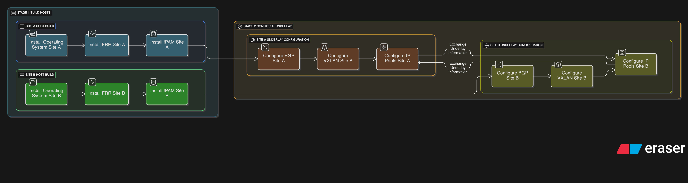

# 🚀 Proxmox Fabric Bootstrap

Provision a full spine-leaf overlay network on Proxmox using modular Ansible roles. This playbook automates underlay VLANs, VXLAN overlays, IPAM integration, BGP peering, NAT/firewall rules, and optional Ceph/ZFS replication bridges.

---

## 🧰 Features

- 🔌 Underlay VLAN bridges (`vmbr10`, `vmbr20`, `vmbr30`)
- 🌐 VXLAN overlays for internal, proxy, Ceph public, and cluster traffic
- 📦 IPAM pools for dynamic VM provisioning
- 🧭 BGP sessions between spine and leaf nodes
- 🔥 NAT/SNAT for egress traffic
- 🛡️ Proxmox firewall rules for ingress control
- 🧪 Molecule tagging for targeted testing
- 🧬 Optional Ceph/ZFS replication overlays

---

## 📁 Role Breakdown

| Role           | Description                                   |
| -------------- | --------------------------------------------- |
| `underlay`     | Sets up physical bridges and VLANs            |
| `bgp`          | Configures FRR BGP sessions                   |
| `vxlan`        | Creates VXLAN interfaces and bridges          |
| `ipam`         | Registers IPAM pools in Proxmox               |
| `vm_nic`       | Attaches VM NICs to correct overlays          |
| `nat`          | Applies SNAT rules for internal traffic       |
| `proxy`        | Configures firewall rules for Traefik ingress |
| `ceph_network` | Sets up Ceph/ZFS replication bridges          |

---


[View on Eraser](https://app.eraser.io/workspace/p8tk5YAidr4AzpPcqNX2)

---

## 📦 Requirements

- Proxmox VE 9.0+ (required for SDN Fabrics and fabricd)
- Ansible 2.10+
- FRR installed on all nodes
- Proxmox IPAM plugin (optional)
- Molecule + Testinfra (for testing)

---

```markdown

## 🔧 Installation Steps

### 🧭 Install FRR (Free Range Routing)

FRR is required for BGP peering and dynamic routing.

```bash
echo "deb http://deb.frrouting.org/frr $(lsb_release -s -c) frr-stable" | tee /etc/apt/sources.list.d/frr.list
curl -s https://deb.frrouting.org/frr/keys.asc | apt-key add -
apt update
apt install frr frr-pythontools -y
```

Enable and start the FRR service:

```bash
systemctl enable frr
systemctl start frr
```

---

### 📦 Install Proxmox IPAM Plugin (Optional but Recommended)

IPAM allows dynamic IP assignment for VMs and overlays.

```bash
apt update
apt install pve-ipam -y
```

Enable IPAM in the cluster config:

```bash
pvesh set /cluster/config --ipam 1
```

Then configure pools via GUI or API.

---

### 🧪 Install Molecule + Testinfra (for Role Testing)

Use a Python virtual environment to isolate dependencies:

```bash
python3 -m venv .venv
source .venv/bin/activate
pip install --upgrade pip
pip install molecule molecule-docker testinfra ansible
```

Verify installation:

```bash
molecule --version
```

You’re now ready to run:

```bash
molecule converge
```

Use tags to target specific tests:

```bash
molecule converge --tags verify_bgp,verify_vxlan
```

Refer to `molecule_tags.conf` for available tags.

## 🚀 Usage

### 1. Clone the Repository

git clone https://github.com/CEP-Comwell/proxmox_addons.git
cd proxmox_addons

### 2. Review Inventory
Edit **inventory.yml** to define your Proxmox nodes and group structure.

Example:
```bash
yaml
all:
  children:
    proxmox:
      hosts:
        pve-node1:
        pve-node2:
```
Make sure hostnames match your actual Proxmox nodes.

### 3. Customize Variables
Edit **group_vars/all.yml** or role-specific defaults to match your environment:

- **VLAN IDs and bridge names**
- **IP ranges for overlays**
- **BGP neighbors and ASNs**
- **Proxy VM IP address**
- **NAT source IPs**
- **Ceph/ZFS replication settings (optional)**

### 4. Run the Playbook
Execute the full provisioning playbook:

```bash
ansible-playbook provision_network.yml -i inventory.yml
```

This will apply all roles in sequence:

- **Underlay bridges**
- **VXLAN overlays**
- **IPAM pools**
- **BGP sessions**
- **NAT/firewall rules**
- **Optional Ceph/ZFS overlays**

### 5. Run Molecule Tests
Use Molecule to test specific components:

```bash
molecule converge --tags verify_bgp,verify_vxlan
```
Available tags include:

- **verify_underlay**
- **verify_bgp**
- **verify_vxlan**
- **verify_ipam**
- **verify_nat**
- **verify_proxy**
- **verify_ceph**

Refer to molecule_tags.conf for the full list.

### 🧠 Notes
vmbrceph_pub and vmbrceph_cluster are optional bridges for Ceph or ZFS replication.

Firewall rules default to DROP with explicit ACCEPT for HTTP, HTTPS, and ICMP.

Roles are modular—run them individually or as a full stack.

Cloud-Init integration is planned for future versions.

IPAM integration is optional but recommended for dynamic VM provisioning.

📜 License
MIT © CEP-Comwell