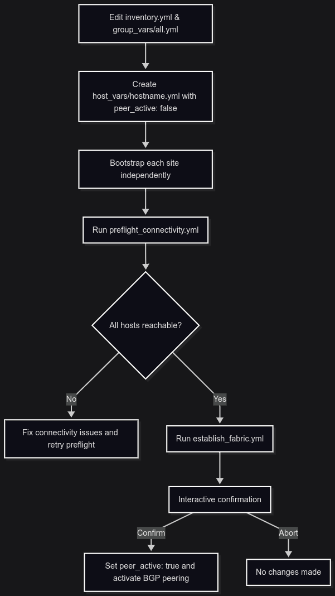

# edgesec-SDN


---

## What does this show?

This documentation demonstrates how to use Ansible roles to automate the deployment of a scalable, secure, and automated **spine-leaf network fabric** across multiple Proxmox nodes and locations.  
It highlights a hyper-converged infrastructure approach, supporting zero trust and microsegmentation initiatives, and shows how each modular role contributes to building a robust, multi-site network fabric.

---

## Overview

The Fabric Bootstrap system is implemented as a set of Ansible roles, each responsible for a key aspect of the network fabric:

- **`underlay`**  
  Automates the configuration of the L3 underlay network, including routed interfaces and basic connectivity.

- **`bgp`**  
  Deploys and configures BGP routing for dynamic, scalable fabric control.

- **`vxlan`**  
  Automates VXLAN overlay setup for scalable L2 extension and tenant segmentation.

- **`ipam`**  
  Integrates with IP address management systems to automate address allocation and tracking.

- **`vm_nic`**  
  Manages VM network interface configuration for seamless integration with the fabric.

Each role is designed for composability, enabling you to build a robust, multi-site, microsegmented network fabric with minimal manual intervention.

---

## Features

- **Spine-Leaf Architecture:**  
  Automates deployment of a scalable, multi-site spine-leaf topology across Proxmox clusters.

- **Zero Trust & Microsegmentation:**  
  Supports advanced segmentation and security policies at the network fabric level.

- **Multi-Site Support:**  
  Enables consistent network provisioning across geographically distributed Proxmox nodes.

- **Automated Underlay & Overlay:**  
  Handles both routed underlay and VXLAN overlays for flexible, scalable networking.

- **Integrated IPAM:**  
  Automates IP address assignment and management.  
  _For Proxmox Web GUI configuration, see [configure_IPAM_in_Proxmox.md](configure_IPAM_in_Proxmox.md)._

- **Test Automation:**  
  Includes Molecule scenarios for role testing and validation.

---

## Directory Structure

- `roles/underlay/` — Underlay network automation
- `roles/bgp/` — BGP routing automation
- `roles/vxlan/` — VXLAN overlay automation
- `roles/ipam/` — IPAM integration
- `roles/vm_nic/` — VM NIC management
- `config.yml` — Central configuration for all roles
- `inventory` — Ansible inventory for your Proxmox environment
- `provision_network.yml` — Example playbook for fabric provisioning

---

## Usage

1. **Configure your inventory and `config.yml`** with your Proxmox nodes, fabric topology, and role variables.

2. **Run the network provisioning playbook:**
   ```bash
   ansible-playbook -i inventory provision_network.yml
   ```

3. **Test and validate roles using Molecule:**
   ```bash
   cd roles/underlay
   molecule test
   ```

4. **For IPAM GUI integration:**  
   See [configure_IPAM_in_Proxmox.md](configure_IPAM_in_Proxmox.md) for step-by-step instructions on integrating IPAM with the Proxmox web interface.

---

## 🚀 Quickstart

1. **Clone this repository and install Ansible on your control node.**

2. **Edit your inventory file (`inventory.yml`):**
   - Define all Proxmox nodes, their IPs, and groupings.
   - Example:
     ```yaml
     all:
       children:
         proxmox:
           hosts:
             pve-node1:
               ansible_host: 192.168.10.11
             pve-node2:
               ansible_host: 192.168.10.12
             pve-node3:
               ansible_host: 192.168.10.13
         site1:
           hosts:
             pve-node1:
             pve-node2:
         site2:
           hosts:
             pve-node3:
     ```

3. **Customize variables in `group_vars/all.yml`:**
   - Set your underlay interface, VLANs, overlays, gateways, and proxy/NAT IPs.

4. **Create or update `host_vars/<hostname>.yml` for each host:**
   - Set `peer_active: false` for all hosts initially.
   - Example:
     ```yaml
     peer_active: false
     ```

5. **Bootstrap each site independently:**
   ```bash
   ansible-playbook -i inventory.yml site1_bootstrap.yml
   ansible-playbook -i inventory.yml site2_bootstrap.yml
   # Repeat for additional sites as needed
   ```
   > **Tip:** For each new site, copy `site1_bootstrap.yml` and change the `hosts:` line to match your site group.

6. **Run the preflight connectivity check:**
   ```bash
   ansible-playbook -i inventory.yml preflight_connectivity.yml
   ```
   - This ensures all Proxmox hosts can reach each other before enabling BGP peering.

7. **Establish BGP peering interactively:**
   ```bash
   ansible-playbook -i inventory.yml establish_fabric.yml
   ```
   - You will be prompted for confirmation before BGP peering is activated.

8. **For IPAM GUI integration:**  
   See [configure_IPAM_in_Proxmox.md](configure_IPAM_in_Proxmox.md) for step-by-step instructions.

---

**Notes:**
- The staged workflow ensures each site is autonomous and fault-tolerant.
- BGP peering is only enabled after all hosts are reachable and you confirm activation.
- All variables and host-specific settings are managed in `group_vars/` and `host_vars/`.

---




## VXLAN Overlay Structure


The SDN fabric uses three primary bridges for strict segmentation. Overlays are grouped by bridge for clarity:

**vmbr0 (Management Bridge)**

| 🟦 overlay name   | overlay type   | Description/Role         | VNI Example |
|:------------------|:--------------|:------------------------|:-----------:|
| management        | management    | Management traffic, RBAC, remote admin | 10100 |
| ceph_cluster      | ceph cluster  | Legacy Ceph cluster overlay | 10031 |
| ceph_pub          | ceph pub      | Legacy Ceph public overlay | 10030 |
| engineering       | engineering   | Engineering/ops traffic, RBAC | 10101 |
| support           | support       | Support/field ops, RBAC | 10102 |

**vmbr1 (VM/Services Bridge)**

| 🟨 overlay name   | overlay type   | Description/Role         | VNI Example |
|:------------------|:--------------|:------------------------|:-----------:|
| services          | dns           | Common DNS overlay, RBAC/namespace | 9000 |
| services          | monitoring    | Common monitoring overlay | 9001 |
| services          | vault         | edgesec-VAULT overlay, RBAC/namespace | 9006 |
| services          | rest          | REST API overlay for external access | 9005 |
| services          | radius        | RADIUS overlay for external auth | 9004 |
| tenant            | vm/service    | Tenant VM/service overlay (one per host) | 10110 |

**vmbr2 (External/Leaf-Edge Gateway Bridge)**

| 🟥 overlay name   | overlay type   | Description/Role         | VNI Example |
|:------------------|:--------------|:------------------------|:-----------:|
| external          | external      | Tenant external/gateway overlay | 10120 |
| proxy_ext         | proxy ext     | Proxy overlay for external access | 9003 |

**Notes:**
- Each tenant (Proxmox host) has its own set of management, engineering, support, service, and external overlays, with unique VNIs.
- Common service overlays (DNS, monitoring, proxy, vault, etc.) are present at each site and use RBAC and namespace controls for isolation.
- `vmbr0` is strictly for management, engineering, and support overlays and legacy services.
- `vmbr1` is for tenant VM/service overlays and common access overlays (DNS, monitoring, proxy).
- `vmbr2` is configured as a leaf-edge gateway in the spine-leaf topology. It provides uplink connectivity to both primary and secondary Internet transit gateways, bridges legacy VLAN segments into the fabric, and enables dynamic traffic routing and integration with external networks. This interface serves as a key ingress/egress point for edge workloads and external service overlays (proxy_ext, radius, rest, vault).
- Microsegmentation and RBAC are enforced at every level (bridge, overlay, service) using Ansible and edgesec platform controls.

### Example Overlay Assignment (Tenant 1)

| Overlay Name         | VNI   | Bridge |
|---------------------|-------|--------|
| tenant1_management  | 10100 | vmbr0  |
| tenant1_engineering | 10101 | vmbr0  |
| tenant1_support     | 10102 | vmbr0  |
| tenant1_service     | 10110 | vmbr1  |
| tenant1_external    | 10120 | vmbr2  |

### Common Service Overlays (per site)

| Overlay Name | VNI   | Bridge | Description |
|--------------|-------|--------|-------------|
| dns          | 9000  | vmbr1  | DNS (RBAC, namespace)
| monitoring   | 9001  | vmbr1  | Monitoring
| proxy        | 9002  | vmbr1  | Proxy for tenant services
| proxy_ext    | 9003  | vmbr2  | Proxy for external access
| radius       | 9004  | vmbr2  | RADIUS for external auth
| rest         | 9005  | vmbr2  | REST API for external access
| vault        | 9006  | vmbr2  | edgesec-VAULT (RBAC, namespace)

### Legacy Overlays

| Overlay Name | VNI    | Bridge |
|--------------|--------|--------|
| ceph_pub     | 10030  | vmbr0  |
| ceph_cluster | 10031  | vmbr0  |

For a visual reference, see the architecture diagram and `blob/mmd/edgesec-single-tenant-bridges.mmd`.

---

## Security

- Use Ansible Vault to encrypt sensitive variables such as BGP passwords, SNMP communities, and API tokens:
  ```bash
  ansible-vault encrypt group_vars/all.yml
  ansible-vault encrypt host_vars/pve-node1.yml
  ```
- Never commit secrets or credentials to version control.
- Limit access to inventory and configuration files to trusted users.
- Regularly rotate credentials and audit playbooks for exposure.

## References

- [EdgeSec Platform Architecture](docs/architecture.md)
- [Ansible Vault Documentation](https://docs.ansible.com/ansible/latest/user_guide/vault.html)