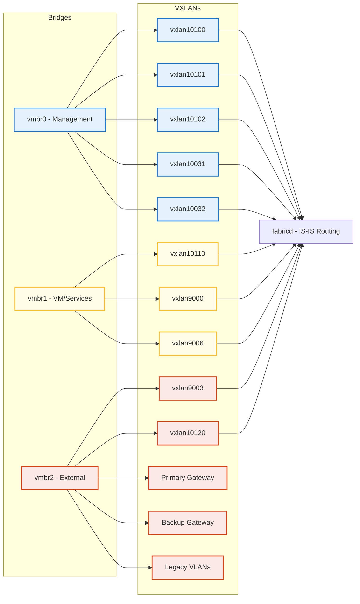
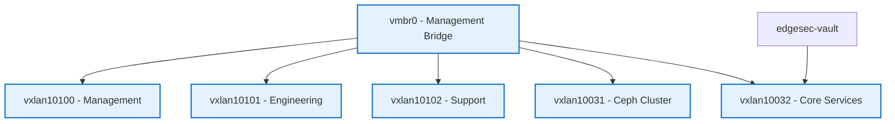
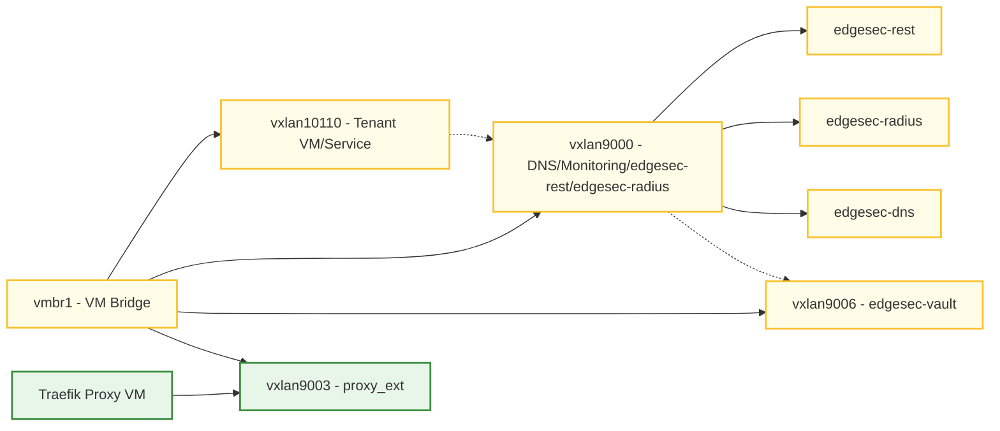
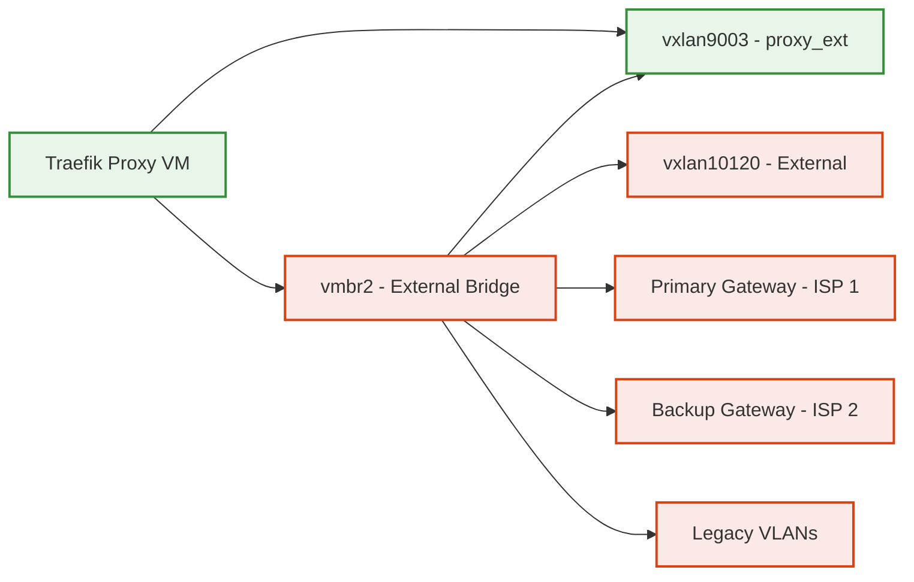

  


## PROXMOX_ADDONS

This repository provides advanced Ansible automation and monitoring add-ons for Proxmox-based hyper-converged infrastructure.  


## 🛰️ [edgesec-SDN](edgesec-sdn/README.md)
*Automated SDN fabric orchestration for Proxmox and multi-site edge environments.*

A modular Ansible role and playbook collection for deploying, managing, and monitoring SDN overlays, microsegmentation, and multi-site fabric topologies in Proxmox-based HCI.

**Network Diagrams:**

### edgesec-SDN: Bridges and Connected VXLANs


### vmbr0 (Management Bridge)


### vmbr1 (VM/Services Bridge)


### vmbr2 (External/Leaf-Edge Gateway Bridge)



**Features:**
- Automated multi-site fabric bootstrap and configuration
- Spine-leaf topology with OpenFabric integration
- Zero trust, microsegmentation, and RBAC support
- Dynamic inventory and network map generation
	- Integration with edgesec-VAULT for secrets management

**Quick Start:**
1. Review [Fabric_bootstrap.md](Fabric_bootstrap.md) for prerequisites and setup steps.
2. Configure your environment in `inventory` and `config.yml`, ensuring bridge and overlay assignments match the diagram.
3. Run the provided playbooks to deploy the fabric.

**Configuration Options:**
- Centralized settings in `config.yml` (see bridge and overlay variables)
- Per-node and per-site variables in `group_vars/` and `host_vars/`
	- edgesec-VAULT integration for sensitive data

**Integration Points:**
- Works with edgesec-RADIUS for authentication
- Integrates with edgesec-REST backend for device enrollment
- Supports traffic mirroring for DPI/IDS via VM & Docker roles

**References:**
- [Fabric_bootstrap.md](Fabric_bootstrap.md)
<!-- - [docs/architecture.md](docs/architecture.md) -->
<!-- - [docs/integration-guide.md](docs/integration-guide.md) -->


---

## 🆔 [edgesec-RADIUS](edgesec-radius/README.md)
*Multi-tenant, certificate-based authentication and device onboarding.*

**Overview:**
Modular Ansible role for multi-tenant, certificate-based authentication and integration with Vault, Authentik, Smallstep CA, FreeRADIUS, and NetBox.

**Features:**
- Multi-tenant RADIUS authentication
- Certificate-based device enrollment
- Vault and Authentik integration
- Smallstep CA and FreeRADIUS support
- NetBox asset management

**Quick Start:**
1. Review [edgesec-radius/README.md](edgesec-radius/README.md) for setup and requirements.
2. Configure tenants and secrets in Vault and Ansible variables.
3. Deploy the role using the provided playbooks.

**Configuration Options:**
- Tenant and certificate settings in `group_vars/` and `host_vars/`
- Vault integration for secrets

**Integration Points:**
- Works with SDN Fabric for network access control
- Integrates with edgesec-REST for device onboarding

**References:**
- [edgesec-radius/README.md](edgesec-radius/README.md)
<!-- - [docs/security-best-practices.md](docs/security-best-practices.md) -->


---

## 🛡️ [edgesec-VAULT](edgesec-vault/README.md)
*Centralized secrets management for the edgesec HCI platform using HashiCorp Vault.*

A HashiCorp Vault deployment for the edgesec HCI platform, serving as the central source of truth for all credentials and secrets. Designed for multi-tenant environments and integrates with the Proxmox SDN Fabric and all edgesec platform components.

**Features:**
- Centralized secrets management for edgesec HCI
- Multi-tenant isolation using Vault namespaces
- Integrates with edgesec-RADIUS, edgesec-REST, and other platform services
- Easy deployment via Docker Compose

**Quick Start:**
1. See [edgesec-vault/README.md](edgesec-vault/README.md) for setup and usage.
2. Start Vault with Docker Compose and initialize/unseal as described.
3. Create tenant namespaces and configure PKI, policies, and authentication as needed.

**References:**
- [Vault Namespaces Documentation](https://developer.hashicorp.com/vault/docs/enterprise/namespaces)
- [Vault Docker Documentation](https://hub.docker.com/_/vault)
- [edgesec-vault/README.md](edgesec-vault/README.md)


---

## 🐳 [edgesec-DEPLOY](/edgesec-deploy/README.md)
*Universal, Vault-integrated Docker app deployment with Traefik and Portainer support.*

**Overview:**
This module provides a universal Ansible role for deploying any Dockerized application securely and flexibly. It supports dynamic docker-compose generation, HashiCorp Vault secret injection, Traefik label auto-injection for reverse proxying, and Portainer or native Compose deployment. App-specific config templating is also supported.

**Features:**
- Deploy any Docker app by setting variables (no code changes needed)
- Dynamic Compose file generation
- Secure secret injection from Vault
- Traefik-ready by default (auto-labeling)
- Portainer or native Compose deployment
- App config templating with Jinja2

**Quick Start:**
1. See [edgesec-deploy/README.md](edgesec-deploy/README.md) for setup and usage.
2. Add app-specific config templates to `roles/docker_app_deploy/templates/` as needed.
3. Set per-app variables in your playbook, `group_vars/`, or `host_vars/`.
4. Deploy with a single command:
	 ```sh
	 # Example: Deploy Plex with this universal role
	 ansible-playbook -i inventory edgesec-deploy/edgesec-deploy-docker.yml \
		 -e app_name=plex \
		 -e image=linuxserver/plex
	 ```

**Integration Points:**
- Works with Vault for secrets
- Traefik for reverse proxying
- Portainer for container management

---
## 🧩 [edgesec-REST](edgesec-rest/README.md)
*Fastify v5 + TypeScript API hub for edge security automation and orchestration.*

A Fastify v5 + TypeScript API hub for edge security automation and orchestration.  
Key integrations:
- **Datto RMM**: Device inventory ingestion
- **NetBox**: Source of truth for device metadata
- **NetBird**: SDN and ACL automation
- **Proxmox VE 9**: HCI orchestration (VM lifecycle, SDN, ZFS datasets)
- **Ollama + OpenWebUI**: Local LLM inference (Mistral, etc.)
- **Microsoft Teams**: Notifications via Graph API or Workflows webhooks

**Tech Highlights**
- Fastify v5 with JSON Schema validation
- Plugin-based architecture for connectors
- Node.js 20+, TypeScript, ESLint v9 flat config
- Docker & Docker Compose support (optional Ollama/OpenWebUI services)

**Quick Start**
```bash
cd edgesec-rest
npm ci
npm run dev        # start dev server
npm run build      # compile TypeScript
npm start          # run compiled build
```

---

## 🗂 Directory Structure

> **Note:** Each subproject has its own `README.md` and quick start. Roles and playbooks are organized for modular use and cross-integration. The `edgesec-rest` directory is the core integration hub.
<details>
  <summary>📂 Directory Structure</summary>

  ```text
proxmox_addons/
├── config.yml                # Central configuration for all playbooks and roles
├── inventory                 # Ansible inventory for your environment
├── group_vars/               # Group variables for Ansible
├── host_vars/                # Host-specific variables for Ansible
├── roles/                    # Shared and project-specific Ansible roles
│
├── edgesec-tapx/             # Modular traffic/probe automation (VM, Docker, VXLAN, HCI agent)
│   ├── playbooks/
│   ├── roles/
│   └── README.md
│
├── edgesec-sdn/              # SDN fabric automation (multi-site, overlays, microsegmentation)
│   ├── playbooks/
│   ├── roles/
│   └── README.md
│
├── edgesec-radius/           # Multi-tenant RADIUS authentication and device onboarding
│   ├── playbooks/
│   ├── roles/
│   └── README.md
│
├── edgesec-vault/            # HashiCorp Vault deployment for secrets management
│   ├── docker-compose.yml
│   └── README.md
│
├── edgesec-rest/             # Core integration hub (Fastify v5 + TypeScript API)
│   ├── src/
│   │   ├── server.ts
│   │   ├── plugins/
│   │   ├── routes/
│   │   ├── schemas/
│   │   ├── lib/
│   │   └── tests/
│   ├── package.json
│   ├── tsconfig.json
│   ├── Dockerfile
│   ├── docker-compose.yml
│   └── README.md
│
├── Fabric_bootstrap.md       # SDN fabric documentation
├── ...other docs...
└── README.md                 # Main project overview (this file)
```
  </details>

**Key Integration Hub:**  
- `edgesec-rest/` is the central API and automation hub, integrating with all other subprojects (Vault, SDN, TAPx, RADIUS) and external systems (NetBox, Datto RMM, NetBird, etc).

**Each subproject** has its own `README.md` and quick start, with roles and playbooks organized for modular use and cross-integration.

---

MIT © CEP-Comwell


