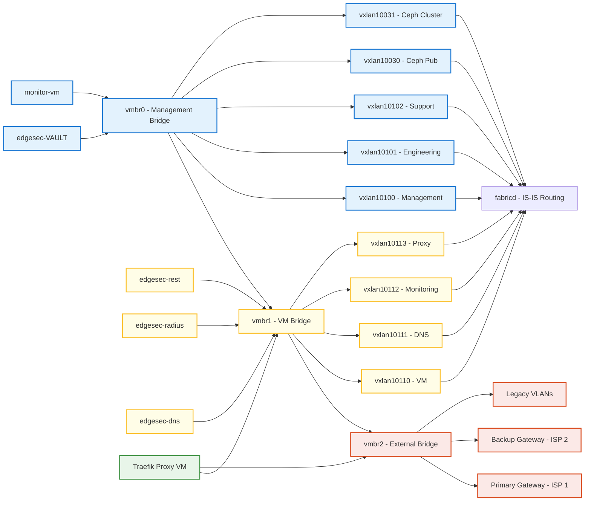

# PROXMOX_ADDONS

This repository provides advanced Ansible automation and monitoring add-ons for Proxmox-based hyper-converged infrastructure.  
It is organized into modular subprojects, each with its own documentation and roles.

---

## 📦 Subprojects


### [edgesec-TAPx](edgesec-tapx/README.md)
#### edgesec-TAPx
*Modular traffic and probe automation for full packet visibility and DPI in Proxmox and Docker environments.*

**Overview:**
Automates probing and mirroring of VM, Docker, VXLAN, and HCI agent network traffic to a monitoring bridge for DPI, IDS, or security analysis. Supports dynamic discovery and persistent setup of tap, Docker, and VXLAN interfaces, with modular roles for each probe type.

**Features:**
- Dynamic discovery of VM, Docker, and VXLAN interfaces
- Automated veth/bridge setup and teardown
- Persistent traffic mirroring and probe routines for DPI/IDS
- Automated cleanup routines for each probe role
- Modular, extensible Ansible roles for each probe type

**Quick Start:**
1. See [edgesec-tapx/README.md](edgesec-tapx/README.md) for setup instructions and usage details.
2. Configure monitoring bridge and interfaces in `config.yml`.
3. Run the relevant probe playbooks to enable mirroring and traffic analysis.

**Configuration Options:**
- Monitoring bridge and interface settings in `config.yml`
- Per-host variables in `host_vars/`

**Integration Points:**
- Integrates with SDN Fabric for network topology
- Supports DPI/IDS tools via mirrored traffic
- Designed for orchestration via edgesec-REST API

**References:**
- [edgesec-tapx/README.md](edgesec-tapx/README.md)
- [docs/integration-guide.md](docs/integration-guide.md)


### [edgesec-SDN](Fabric_bootstrap.md)
#### edgesec-SDN

**Overview:**
Comprehensive Ansible framework for deploying a scalable, multi-site spine-leaf network fabric across Proxmox nodes and locations, powered by OpenFabric. Implements zero trust and microsegmentation strategies for hyper-converged infrastructure.


**Network Architecture:**
- The SDN fabric is built around three primary bridges:
	- `vmbr0` (Management, left): Hosts management, engineering, and support overlays, as well as storage overlays (ceph_pub, ceph_cluster).
	- `vmbr1` (VM/Services, center): Hosts tenant/service overlays and all core service overlays (DNS, Monitoring, Vault, REST, RADIUS).
	- `vmbr2` (External, right): Connects to external gateways and legacy VLANs, and provides external access overlays (proxy_ext, external).
- Overlays (VXLANs) are mapped to these bridges for isolation and segmentation, as shown in the architecture diagram below.


**Reference Diagram (Mermaid):**

Mermaid source: [`blob/mmd/edgesec-single-tenant-bridges.mmd`](blob/mmd/edgesec-single-tenant-bridges.mmd)

**Features:**
- Automated multi-site fabric bootstrap and configuration
- Spine-leaf topology with OpenFabric integration
- Zero trust, microsegmentation, and RBAC support
- Dynamic inventory and network map generation
	- Integration with edgesec-VAULT for secrets management

**Quick Start:**
1. Review [Fabric_bootstrap.md](Fabric_bootstrap.md) for prerequisites and setup steps.
2. Configure your environment in `inventory` and `config.yml`, ensuring bridge and overlay assignments match the diagram.
3. Run the provided playbooks to deploy the fabric.

**Configuration Options:**
- Centralized settings in `config.yml` (see bridge and overlay variables)
- Per-node and per-site variables in `group_vars/` and `host_vars/`
	- edgesec-VAULT integration for sensitive data

**Integration Points:**
- Works with edgesec-RADIUS for authentication
- Integrates with edgesec-REST backend for device enrollment
- Supports traffic mirroring for DPI/IDS via VM & Docker roles

**References:**
- [Fabric_bootstrap.md](Fabric_bootstrap.md)
- [docs/architecture.md](docs/architecture.md)
- [docs/integration-guide.md](docs/integration-guide.md)

### [edgesec-RADIUS](edgesec-radius/README.md)
#### edgesec-RADIUS

**Overview:**
Modular Ansible role for multi-tenant, certificate-based authentication and integration with Vault, Authentik, Smallstep CA, FreeRADIUS, and NetBox.

**Features:**
- Multi-tenant RADIUS authentication
- Certificate-based device enrollment
- Vault and Authentik integration
- Smallstep CA and FreeRADIUS support
- NetBox asset management

**Quick Start:**
1. Review [edgesec-radius.md](edgesec-radius/README.md) for setup and requirements.
2. Configure tenants and secrets in Vault and Ansible variables.
3. Deploy the role using the provided playbooks.

**Configuration Options:**
- Tenant and certificate settings in `group_vars/` and `host_vars/`
- Vault integration for secrets

**Integration Points:**
- Works with SDN Fabric for network access control
- Integrates with edgesec-REST for device onboarding

**References:**
- [edgesec-radius.md](edgesec-radius/README.md)
- [docs/security-best-practices.md](docs/security-best-practices.md)


### [edgesec-REST](edgesec-rest/README.md)
#### edgesec-REST

A Fastify v5 + TypeScript API hub for edge security automation and orchestration.  
Key integrations:
- **Datto RMM**: Device inventory ingestion
- **NetBox**: Source of truth for device metadata
- **NetBird**: SDN and ACL automation
- **Proxmox VE 9**: HCI orchestration (VM lifecycle, SDN, ZFS datasets)
- **Ollama + OpenWebUI**: Local LLM inference (Mistral, etc.)
- **Microsoft Teams**: Notifications via Graph API or Workflows webhooks

**Tech Highlights**
- Fastify v5 with JSON Schema validation
- Plugin-based architecture for connectors
- Node.js 20+, TypeScript, ESLint v9 flat config
- Docker & Docker Compose support (optional Ollama/OpenWebUI services)

**Quick Start**
```bash
cd edgesec-rest
npm ci
npm run dev        # start dev server
npm run build      # compile TypeScript
npm start          # run compiled build
```

---


## 🗂 Directory Structure

- `roles/` — Ansible roles for each feature or subproject
- `traffic_mirror.md` — Documentation for VM & Docker traffic mirroring
- `Fabric_bootstrap.md` — Documentation for the Proxmox SDN Fabric system
- `config.yml` — Central configuration for playbooks
- `inventory` — Ansible inventory file for your environment

### edgesec-REST

```
edgesec-rest/
├─ src/
│  ├─ server.ts
│  ├─ plugins/            # Fastify plugins (Datto, NetBox, NetBird, Proxmox, Ollama, Teams)
│  ├─ routes/
│  │  └─ v1/              # API routes grouped by version
│  ├─ schemas/            # JSON Schemas for validation
│  ├─ lib/                # Shared utilities
│  └─ tests/              # Unit/integration tests
├─ package.json
├─ tsconfig.json
├─ eslint.config.js       # ESLint v9 flat config
├─ Dockerfile
├─ docker-compose.yml     # Optional Ollama/OpenWebUI services
└─ README.md
```
> **edgesec-REST**: Fastify v5 + TypeScript API hub for edge security automation. Integrates Datto RMM, NetBox, NetBird, Proxmox VE, Ollama, and Teams.

---

## 🚀 Getting Started

Each subproject has its own quick start and requirements.  
See [traffic_mirror.md](traffic_mirror.md) and [Fabric_bootstrap.md](Fabric_bootstrap.md) for details.

---

MIT © CEP-Comwell


