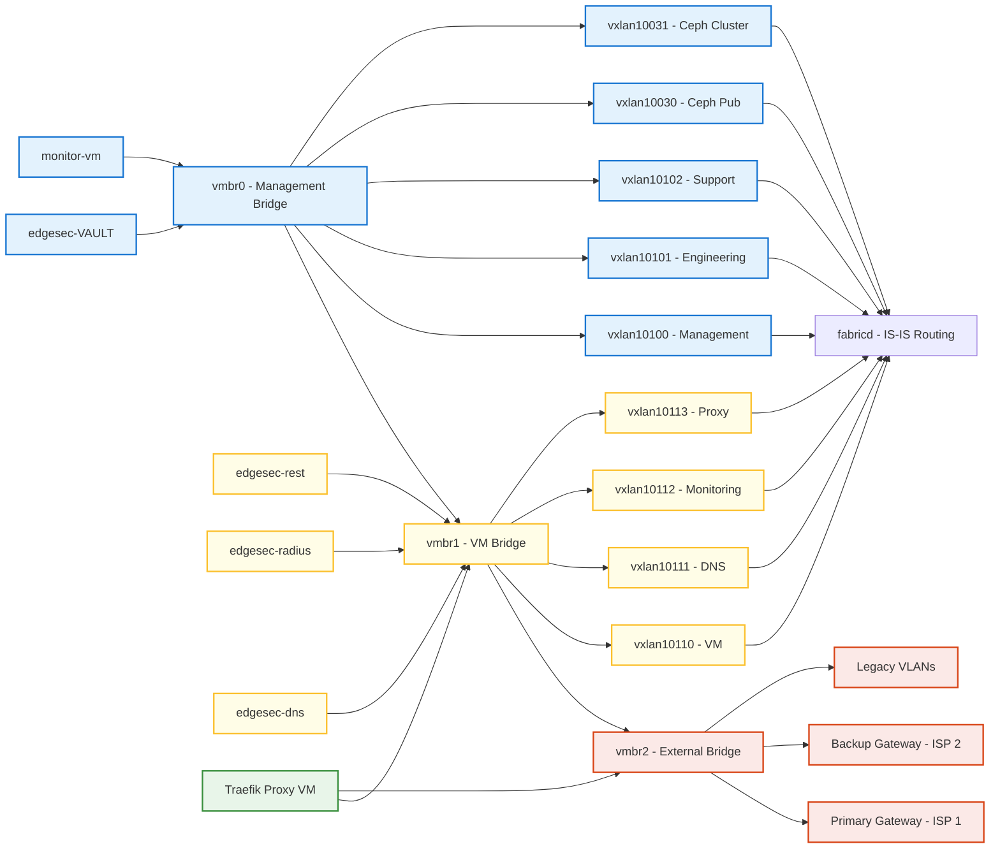

# PROXMOX_ADDONS

This repository provides advanced Ansible automation and monitoring add-ons for Proxmox-based hyper-converged infrastructure.  
It is organized into modular subprojects, each with its own documentation and roles.

---

## 📦 Subprojects

### [edgesec-TAPx](traffic_mirror.md)
#### edgesec-TAPx
*Modular traffic mirroring with SIEM-triggered full packet visibility.*

**Overview:**
Automates mirroring of VM and Docker network traffic to a monitoring bridge for DPI, IDS, or security analysis. Supports dynamic discovery and persistent setup of tap and Docker bridge interfaces.

**Features:**
- Dynamic tap and Docker bridge discovery
- Automated veth/bridge setup and teardown
- Persistent traffic mirroring for DPI/IDS
- Automated cleanup routines

**Quick Start:**
1. See [traffic_mirror.md](traffic_mirror.md) for setup instructions.
2. Configure monitoring bridge and interfaces in `config.yml`.
3. Run the relevant playbooks to enable mirroring.

**Configuration Options:**
- Monitoring bridge and interface settings in `config.yml`
- Per-host variables in `host_vars/`

**Integration Points:**
- Integrates with SDN Fabric for network topology
- Supports DPI/IDS tools via mirrored traffic

**References:**
- [traffic_mirror.md](traffic_mirror.md)
- [docs/integration-guide.md](docs/integration-guide.md)

### [edgesec-SDN](Fabric_bootstrap.md)
#### edgesec-SDN

**Overview:**
Comprehensive Ansible framework for deploying a scalable, multi-site spine-leaf network fabric across Proxmox nodes and locations, powered by OpenFabric. Implements zero trust and microsegmentation strategies for hyper-converged infrastructure.

**Network Architecture:**
- The SDN fabric is built around three primary bridges:
	- `vmbr0` (Management, left): Hosts management overlays and services (edgesec-VAULT, Monitor, Ceph).
	- `vmbr1` (VM/Services, center): Hosts tenant/service overlays and core services (REST, RADIUS, DNS, Proxy).
	- `vmbr2` (External, right): Connects to gateways, legacy VLANs, and provides external access (Proxy, Radius, REST, edgesec-VAULT).
- Overlays (VXLANs) are mapped to these bridges for isolation and segmentation, as shown in the architecture diagram below.

**Reference Diagram (Mermaid):**

Mermaid source: [`blob/mmd/edgesec-single-tenant-bridges.mmd`](blob/mmd/edgesec-single-tenant-bridges.mmd)

**Features:**
- Automated multi-site fabric bootstrap and configuration
- Spine-leaf topology with OpenFabric integration
- Zero trust, microsegmentation, and RBAC support
- Dynamic inventory and network map generation
	- Integration with edgesec-VAULT for secrets management

**Quick Start:**
1. Review [Fabric_bootstrap.md](Fabric_bootstrap.md) for prerequisites and setup steps.
2. Configure your environment in `inventory` and `config.yml`, ensuring bridge and overlay assignments match the diagram.
3. Run the provided playbooks to deploy the fabric.

**Configuration Options:**
- Centralized settings in `config.yml` (see bridge and overlay variables)
- Per-node and per-site variables in `group_vars/` and `host_vars/`
	- edgesec-VAULT integration for sensitive data

**Integration Points:**
- Works with edgesec-RADIUS for authentication
- Integrates with edgesec-REST backend for device enrollment
- Supports traffic mirroring for DPI/IDS via VM & Docker roles

**References:**
- [Fabric_bootstrap.md](Fabric_bootstrap.md)
- [docs/architecture.md](docs/architecture.md)
- [docs/integration-guide.md](docs/integration-guide.md)

### [edgesec-RADIUS](edgesec-radius.md)
#### edgesec-RADIUS

**Overview:**
Modular Ansible role for multi-tenant, certificate-based authentication and integration with Vault, Authentik, Smallstep CA, FreeRADIUS, and NetBox.

**Features:**
- Multi-tenant RADIUS authentication
- Certificate-based device enrollment
- Vault and Authentik integration
- Smallstep CA and FreeRADIUS support
- NetBox asset management

**Quick Start:**
1. Review [edgesec-radius.md](edgesec-radius.md) for setup and requirements.
2. Configure tenants and secrets in Vault and Ansible variables.
3. Deploy the role using the provided playbooks.

**Configuration Options:**
- Tenant and certificate settings in `group_vars/` and `host_vars/`
- Vault integration for secrets

**Integration Points:**
- Works with SDN Fabric for network access control
- Integrates with edgesec-REST for device onboarding

**References:**
- [edgesec-radius.md](edgesec-radius.md)
- [docs/security-best-practices.md](docs/security-best-practices.md)

### [edgesec-REST Backend](edgesec-rest/README.md)
#### edgesec-REST Backend

**Overview:**
Device enrollment backend following clean architecture and facade patterns. Provides REST API, CLI runner, and Jest tests for device onboarding and management.

**Features:**
- REST API for device enrollment and management
- CLI runner for automation
- Jest-based test suite
- Facade pattern for integration

**Quick Start:**
1. See [edgesec-rest/README.md](edgesec-rest/README.md) for setup and usage.
2. Configure backend settings in environment variables and config files.
3. Run the backend and CLI tools as described in the documentation.

**Configuration Options:**
- Environment variables for backend settings
- Config files for API and CLI options

**Integration Points:**
- Integrates with edgesec-RADIUS for device authentication
- Supports SDN Fabric for network provisioning

**References:**
- [edgesec-rest/README.md](edgesec-rest/README.md)
- [docs/architecture.md](docs/architecture.md)

---

## 🗂 Directory Structure

- `roles/` — Ansible roles for each feature or subproject
- `traffic_mirror.md` — Documentation for VM & Docker traffic mirroring
- `Fabric_bootstrap.md` — Documentation for the Proxmox SDN Fabric system
- `config.yml` — Central configuration for playbooks
- `inventory` — Ansible inventory file for your environment

---

## 🚀 Getting Started

Each subproject has its own quick start and requirements.  
See [traffic_mirror.md](traffic_mirror.md) and [Fabric_bootstrap.md](Fabric_bootstrap.md) for details.

---

MIT © CEP-Comwell

