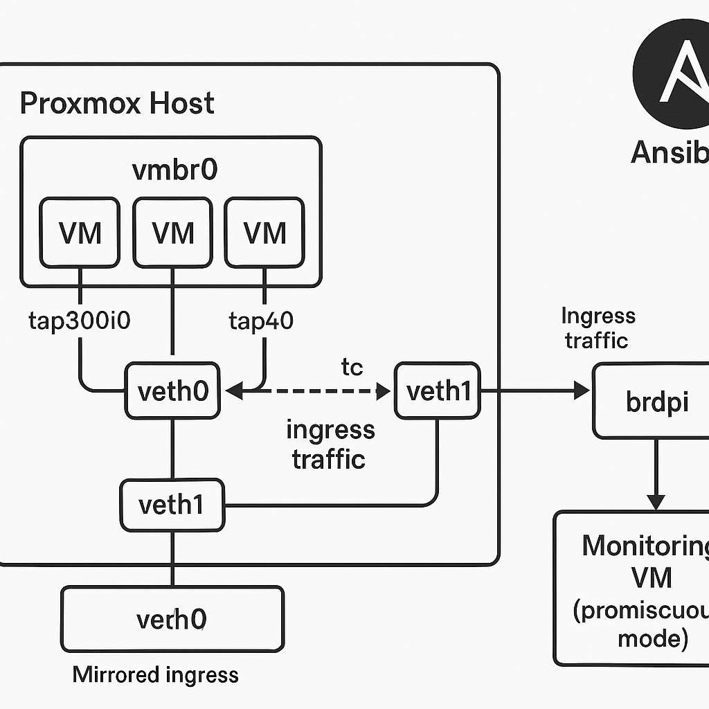

# Proxmox VM Traffic Mirroring with Ansible

**Mirroring Ingress Traffic from VMs to a Monitoring Bridge**

This Ansible playbook configures Proxmox VMs on the default (`vmbr0`) bridge to mirror ingress traffic from each VM's TAP interface, which is automatically assigned by Proxmox at startup.



**How it Works**

* Utilizes a veth interface (`veth0`) and its peer (`veth1`) connected to a designated monitoring bridge (`brdpi`)
* Dynamically configures tc mirroring (traffic control)
* Allows you to assign a monitoring VM to the monitoring bridge and set its network interface in promiscuous mode

**Benefits**

* Enables network traffic analysis and monitoring
* Allows for advanced network monitoring and security tools integration

**Future Development**

* Experimentation with kernel DPDK
* Integration with Falco IDS
* Integration with SecurityOnion

# Playbook Description 
**mirror_vmbr0_to_brdpi.yml**

* The playbook assumes that the veth interfaces (`veth0`) and its peer (`veth1`) have been manually set up and configured on the Proxmox host.

Promox recommends against making any direct changes to `/etc/network/interfaces`.

Instead, you should create a separate network configuration file included with the `source /etc/network/interfaces.d/*` command at the bottom of the proxmox managed network configuration.

Here is an example:

**/etc/network/interfaces.d/edgesec.conf**

  ```bash
# Create veth pair
auto veth0
iface veth0 inet manual
        pre-up ip link delete veth0 type veth || true
        pre-up ip link add veth0 type veth peer name veth1
        up ip link set veth0 up promisc on
        down ip link delete veth0

# Bring up veth1
auto veth1
iface veth1 inet manual
        up ip link set veth1 up promisc on

# Bridge interface for DPI monitoring

auto brdpi
iface brdpi inet manual
	bridge-ports veth1
	bridge-stp off
	bridge-fd 0
        pre-up ip link set brdpi promisc on
        post-down ip link set brdpi promisc off 
  ```
# Subtask Descriptions

* The playbook defines several variables, including:
    + `dest_bridge` : designated monitoring bridge i.e. `brdpi`
    + `mirror_target` : target interface i.e. `veth0`
    + `monitor_vm_ids`: List of VM ID's to exclude for monitoring
* The playbook includes several tasks, including:
	+ Discovering tap interfaces dynamically using `tasks/tap-discover.yml`, which takes advantage of the fact that Proxmox automatically creates tap interfaces associated with each VM ID.
	+ Debugging the list of discovered tap interfaces.
	+ Skipping mirroring setup if no tap interfaces are found.
	+ Applying mirroring to each tap interface using `tasks/mirror-task.yml`.

**tasks/tap-discover.yml**

* This subtask discovers tap interfaces dynamically, leveraging the fact that Proxmox automatically creates tap interfaces associated with each VM ID.

**tasks/mirror-task.yml**

* This subtask configures traffic mirroring from a given tap interface (`tap_if`) to the designated mirror target interface (`mirror_target`), typically `veth0`.
* The subtask ensures the tap interface is up, adds an ingress qdisc to the tap interface, checks if a `tc` mirror filter already exists, and adds a `tc` mirror filter to mirror traffic to the mirror target.
* The subtask also displays active `tc` filters on the tap interface.

**tasks/setup-dpi-monitor.yml**

* Copies the DPI bridge and veth configuration from `files/edgesec.conf` to `/etc/network/interfaces.d/edgesec.conf` and reloads networking.

**tasks/dpi-monitor-cleanup.yml**

* Removes `/etc/network/interfaces.d/edgesec.conf` and reloads networking to clean up the DPI bridge and veth interfaces.

---

## 📦 Features

- Dynamically discovers TAP interfaces (e.g., `tap400i0`)
- Excludes monitoring VMs by VMID
- Applies `tc` mirroring rules to forward traffic to `veth0`
- Designed for Proxmox 8.x
- Persistent DPI bridge and veth setup using `/etc/network/interfaces.d/edgesec.conf`
- Automated cleanup of both mirroring rules and DPI bridge configuration

---

## 🛠 Requirements

- Ansible installed on your control node
- SSH access to Proxmox host(s)
- `tc` available on the Proxmox host
- Monitoring VM connected to the `brdpi` bridge

---

# 🚀 Quick Start

### 1. Clone the Repository

Clone the `proxmox_addons` repository using the following command:
```bash
git clone https://github.com/CEP-Comwell/proxmox_addons.git
```
This will download the repository to your local machine. Once the clone is complete, navigate into the repository directory:
```bash
cd proxmox_addons
```

### 2. Install Ansible

Make sure you have Ansible installed on your system. If you don't have Ansible installed, you can install it using the following command:
```bash
sudo apt-get install ansible
```
or
```bash
sudo yum install ansible
```
depending on your Linux distribution.

### 3. Configure Variables

Edit `config.yml` to set your monitoring bridge, mirror target, and any VM IDs to exclude from monitoring:
```yaml
dest_bridge: "brdpi"
mirror_target: "veth0"
monitor_vm_ids:
  - "401"
```

### 4. Create an Inventory File

Create an Ansible inventory file that defines the hosts and groups for your Proxmox environment. You can use a simple text file with the following format:
```ini
[proxmox-hosts]
proxmox01 ansible_host=192.168.1.100
proxmox02 ansible_host=192.168.1.101
```
Replace the `proxmox01` and `proxmox02` with the actual hostnames or IP addresses of your Proxmox nodes.

### 5. Run the Playbook

To run the playbook, use the following command:
```bash
ansible-playbook -i inventory mirror_vmbr0_to_brdpi.yml
```
Replace `inventory` with the path to your Ansible inventory file. This will execute the playbook and configure the Proxmox VMs to mirror ingress traffic to the designated monitoring bridge.

Note: Make sure you have the necessary permissions and access to the Proxmox nodes before running the playbook.

* The playbook validates required variables before running any tasks.

### 6. Remove Mirroring Rules

To remove mirroring rules, run:
```bash
ansible-playbook -i inventory mirror_cleanup.yml
```

### 7. Remove DPI Bridge and Mirroring Configuration

To fully remove both mirroring rules and the DPI bridge/veth setup, run:
```bash
ansible-playbook -i inventory dpi_bridge_cleanup.yml
```
This will clean up all tc mirroring rules and remove the DPI bridge configuration from `/etc/network/interfaces.d/edgesec.conf`.

* All variables are defined in `config.yml` and loaded automatically by the playbooks.
* Idempotent and safe: checks for existing rules before applying or removing them
* Provides feedback on remaining tc filters after cleanup


