  


## PROXMOX_ADDONS

This repository provides advanced Ansible automation and monitoring add-ons for Proxmox-based hyper-converged infrastructure.  


## 🛰️ [edgesec-SDN](edgesec-sdn/README.md)
*Automated SDN fabric orchestration for Proxmox and multi-site edge environments.*

A modular Ansible role and playbook collection for deploying, managing, and monitoring SDN overlays, microsegmentation, and multi-site fabric topologies in Proxmox-based HCI.


<details>
<summary><strong>Network Diagrams edgesec-SDN: Bridges and Connected VXLANs (click to expand)</strong></summary>

### edgesec-SDN: Bridges and Connected VXLANs

VMBridge --> VX10110
VMBridge --> VX9000
VMBridge --> VX9006

ExtBridge --> VX10120
ExtBridge --> VX9003Ifc
ExtBridge --> VX9006Ifc
ExtBridge --> VX10031Ifc
ExtBridge --> Gateway1
ExtBridge --> Gateway2
ExtBridge --> LegacyVLAN

%% vmbr2 subinterfaces feeding VyOS / SDN fabric
Gateway1 --> VyOSGW
Gateway2 --> VyOSGW
LegacyVLAN --> VyOSGW
VX10031Ifc --> VyOSGW
VX9003Ifc --> VyOSGW
VX9006Ifc --> VyOSGW

%% SDN fabric VNIs terminate on VyOS as the EVPN gateway
VX10100 --> VyOSGW
VX10101 --> VyOSGW
VX10102 --> VyOSGW
VX10110 --> VyOSGW
VX9000 --> VyOSGW
VX9006 --> VyOSGW
VX9003 --> VyOSGW
VX10120 --> VyOSGW
VX10031 --> VyOSGW
VX10032 --> VyOSGW

%% Color coding
classDef mgmt fill:#e3f2fd,stroke:#1976d2,stroke-width:2px;
classDef vm fill:#fffde7,stroke:#fbc02d,stroke-width:2px;
classDef ext fill:#fbe9e7,stroke:#d84315,stroke-width:2px;
class MgmtBridge,VX10100,VX10101,VX10102,VX10031,VX10032 mgmt;
class VMBridge,VX10110,VX9000,VX9006 vm;
class ExtBridge,Gateway1,Gateway2,LegacyVLAN,VX10031Ifc,VX9003Ifc,VX9006Ifc,VX9003,VX10120,VyOSGW ext;
```
</details>

<details>
<summary><strong>Single Node Hybrid Spine-Leaf (click to expand)</strong></summary>

### edgesec-SDN: Single Node Hybrid Spine-Leaf

```mermaid
graph LR
	subgraph ProxmoxNode["Any Proxmox SDN Node"]
		vmbr1["vmbr1 – Tenant Leaf (VXLAN)"]
		vmbr2["vmbr2 – Border/Gateway Leaf"]
		vmbr99["vmbr99 – Ops/Support Leaf"]

		vmbr99 --- vmbr1
		vmbr99 --- vmbr2
		vmbr1 --- vmbr2
	end

	ISP1[(ISP1)]
	ISP2[(ISP2)]
	FRR[(FRR fabricd – Spine Role)]
	LegacyVLAN[(Legacy VLAN Switch / Fabric)]

	ISP1 --- vmbr2
	ISP2 --- vmbr2

	%% VXLAN ↔ VLAN Gateway now off vmbr2
	vmbr2 --- VXGW["VXLAN-to-VLAN Gateway"]
	VXGW --- LegacyVLAN

	FRR --- vmbr1
	FRR --- vmbr2
	FRR --- vmbr99
```

</details>

<details>
<summary><strong>Management Bridge (click to expand)</strong></summary>

### vmbr99 (Management Bridge)

</details>

<details>
<summary><strong>VM/Services Bridge (click to expand)</strong></summary>

### vmbr1 (VM/Services Bridge)

</details>

<details>
<summary><strong>External/Hybrid-Leaf Gateway (click to expand)</strong></summary>

### vmbr2 (External/Hybrid-Leaf Gateway Bridge)

</details>

**Features:**
- Automated multi-site fabric bootstrap and configuration
- Spine-leaf topology with OpenFabric integration
- Zero trust, microsegmentation, and RBAC support
- Dynamic inventory and network map generation
	- Integration with edgesec-VAULT for secrets management

**Quick Start:**
1. Review [Fabric_bootstrap.md](Fabric_bootstrap.md) for prerequisites and setup steps.
2. Configure your environment in `inventory` and `config.yml`, ensuring bridge and overlay assignments match the diagram.
3. Run the provided playbooks to deploy the fabric.

**Configuration Options:**
- Centralized settings in `config.yml` (see bridge and overlay variables)
- Per-node and per-site variables in `group_vars/` and `host_vars/`
	- edgesec-VAULT integration for sensitive data

**Integration Points:**
- Works with edgesec-RADIUS for authentication
- Integrates with edgesec-REST backend for device enrollment
- Supports traffic mirroring for DPI/IDS via VM & Docker roles

**References:**
- [Fabric_bootstrap.md](Fabric_bootstrap.md)
<!-- - [docs/architecture.md](docs/architecture.md) -->
<!-- - [docs/integration-guide.md](docs/integration-guide.md) -->


---

## 🛜 [edgesec-RADIUS](edgesec-radius/README.md)
*Multi-tenant, certificate-based authentication and device onboarding.*

**Overview:**
Modular Ansible role for multi-tenant, certificate-based authentication and integration with Vault, Authentik, Smallstep CA, FreeRADIUS, and NetBox.

**Features:**
- Multi-tenant RADIUS authentication
- Certificate-based device enrollment
- Vault and Authentik integration
- Smallstep CA and FreeRADIUS support
- NetBox asset management

**Quick Start:**
1. Review [edgesec-radius/README.md](edgesec-radius/README.md) for setup and requirements.
2. Configure tenants and secrets in Vault and Ansible variables.
3. Deploy the role using the provided playbooks.

**Configuration Options:**
- Tenant and certificate settings in `group_vars/` and `host_vars/`
- Vault integration for secrets

**Integration Points:**
- Works with SDN Fabric for network access control
- Integrates with edgesec-REST for device onboarding

**References:**
- [edgesec-radius/README.md](edgesec-radius/README.md)
<!-- - [docs/security-best-practices.md](docs/security-best-practices.md) -->


---

## 🛡️ [edgesec-VAULT](edgesec-vault/README.md)
*Centralized secrets management for the edgesec HCI platform using HashiCorp Vault.*

A HashiCorp Vault deployment for the edgesec HCI platform, serving as the central source of truth for all credentials and secrets. Designed for multi-tenant environments and integrates with the Proxmox SDN Fabric and all edgesec platform components.

**Features:**
- Centralized secrets management for edgesec HCI
- Multi-tenant isolation using Vault namespaces
- Integrates with edgesec-RADIUS, edgesec-REST, and other platform services
- Easy deployment via Docker Compose

**Quick Start:**
1. See [edgesec-vault/README.md](edgesec-vault/README.md) for setup and usage.
2. Start Vault with Docker Compose and initialize/unseal as described.
3. Create tenant namespaces and configure PKI, policies, and authentication as needed.

**References:**
- [Vault Namespaces Documentation](https://developer.hashicorp.com/vault/docs/enterprise/namespaces)
- [Vault Docker Documentation](https://hub.docker.com/_/vault)
- [edgesec-vault/README.md](edgesec-vault/README.md)


---

## 🐳 [edgesec-DEPLOY](/edgesec-deploy/README.md)
*Universal, Vault-integrated Docker app deployment with Traefik and Portainer support.*

**Overview:**
This module provides a universal Ansible role for deploying any Dockerized application securely and flexibly. It supports dynamic docker-compose generation, HashiCorp Vault secret injection, Traefik label auto-injection for reverse proxying, and Portainer or native Compose deployment. App-specific config templating is also supported.

**Features:**
- Deploy any Docker app by setting variables (no code changes needed)
- Dynamic Compose file generation
- Secure secret injection from Vault
- Traefik-ready by default (auto-labeling)
- Portainer or native Compose deployment
- App config templating with Jinja2

**Quick Start:**
1. See [edgesec-deploy/README.md](edgesec-deploy/README.md) for setup and usage.
2. Add app-specific config templates to `roles/docker_app_deploy/templates/` as needed.
3. Set per-app variables in your playbook, `group_vars/`, or `host_vars/`.
4. Deploy with a single command:
	 ```sh
	 # Example: Deploy Plex with this universal role
	 ansible-playbook -i inventory edgesec-deploy/edgesec-deploy-docker.yml \
		 -e app_name=plex \
		 -e image=linuxserver/plex
	 ```

**Integration Points:**
- Works with Vault for secrets
- Traefik for reverse proxying
- Portainer for container management

---

## 🧬 [edgesec-TAPx](edgesec-tapx/README.md)
*Modular traffic and probe automation for full packet visibility and DPI in Proxmox and Docker environments.*

This subproject provides modular Ansible automation for probing and mirroring VM, Docker, VXLAN, and HCI agent network traffic to a monitoring bridge (such as `brdpi`) on Proxmox hosts. It enables deep packet inspection (DPI), intrusion detection (IDS), and advanced traffic analytics for both virtual machines and containers.

**Features:**
- Modular Ansible roles for VM, Docker, VXLAN, and HCI agent traffic probing
- Automated mirroring to a dedicated monitoring bridge (`brdpi`)
- Dynamic discovery of tap, bridge, and VXLAN interfaces
- Persistent bridge/veth setup and automated cleanup
- Extensible for new probe types and monitoring targets

**Quick Start:**
1. Configure your inventory and `config.yml` with the appropriate hosts and variables.
2. Run the relevant probe playbook (e.g., `playbooks/probe-vm-net.yml`).
3. Use cleanup playbooks to remove mirroring rules when needed.

See [edgesec-tapx/README.md](edgesec-tapx/README.md) for full details and usage.

---

## 🕸️ [edgesec-REST](edgesec-rest/README.md)

A Fastify v5 + TypeScript API hub for edge security automation and orchestration.  
Key integrations:
- **Datto RMM**: Device inventory ingestion
- **NetBox**: Source of truth for device metadata
- **NetBird**: SDN and ACL automation
- **Proxmox VE 9**: HCI orchestration (VM lifecycle, SDN, ZFS datasets)
- **Ollama + OpenWebUI**: Local LLM inference (Mistral, etc.)
- **Microsoft Teams**: Notifications via Graph API or Workflows webhooks

**Tech Highlights**
- Fastify v5 with JSON Schema validation
- Plugin-based architecture for connectors
- Node.js 20+, TypeScript, ESLint v9 flat config
- Docker & Docker Compose support (optional Ollama/OpenWebUI services)

**Quick Start**
```bash
cd edgesec-rest
npm ci
npm run dev        # start dev server
npm run build      # compile TypeScript
npm start          # run compiled build
```

---

## 🗂 Directory Structure

> **Note:** Each subproject has its own `README.md` and quick start. Roles and playbooks are organized for modular use and cross-integration. The `edgesec-rest` directory is the core integration hub.
<details>
  <summary>📂 Directory Structure</summary>

  ```text
proxmox_addons/
├── cleanup_network.yml
├── config.yml
├── Fabric_bootstrap.md
├── inventory
├── inventory.bak
├── inventory.yml
├── jest.config.js
├── LICENSE
├── molecule_tags.conf
├── package.json
├── proxmox_addons_directory_structure.txt
├── README.md
├── source_env.sh
├── tsconfig.json
├── _archive/
│   ├── cert_auth.md
│   ├── directory_layout.md
│   ├── Fabric_bootstrap.md.bak
│   └── traffic_mirror.md
├── blob/
│   ├── images/
│   │   ├── cloud_radius.png
│   │   ├── edgesec-node1.png
│   │   └── edgesec.png
│   └── mmd/
├── docs/
│   ├── architecture.md
│   ├── contributing.md
│   ├── integration-guide.md
│   ├── README-template.md
│   └── README.md
├── edgesec-deploy/
│   ├── edgesec-deploy-docker.yml
│   └── README.md
├── edgesec-radius/
│   └── README.md
├── edgesec-rest/
│   ├── docker-compose.yml
│   ├── Dockerfile
│   ├── package.json
│   ├── README.md
│   └── src/
├── edgesec-sdn/
│   ├── README.md
│   ├── docker/
│   └── playbooks/
├── edgesec-tapx/
│   ├── README.md
│   └── playbooks/
├── edgesec-vault/
│   ├── docker-compose.yml
│   └── README.md
├── files/
│   └── edgesec.conf
├── group_vars/
│   ├── all.yml
│   └── network_map.yml
├── host_vars/
│   ├── pve-node1.yml
│   ├── pve-node2.yml
│   └── pve-node3.yml
├── import/
│   ├── configure_IPAM_in_Proxmox.md
│   └── pdf_to_md.py
├── lib/
│   └── src/
├── roles/
│   ├── bgp/
│   ├── ceph_network/
│   ├── docker_app_deploy/
│   ├── docker_traffic_mirror/
│   ├── dpi_monitor_setup/
│   ├── establish_fabric/
│   ├── ipam/
│   ├── nat/
│   ├── network_provision/
│   ├── nftables/
│   ├── preflight/
│   ├── probe-docker-overlay/
│   ├── probe-hci-agent/
│   ├── probe-vm-net/
│   ├── probe-vxlan-node/
│   ├── proxy/
│   ├── underlay/
│   ├── vm_nic/
│   ├── vm_traffic_mirror/
│   └── vxlan/
├── src/
│   ├── config.ts
│   └── application/
├── tasks/
│   ├── docker-network-discover.yml
│   └── tap-discover.yml
├── tests/
│   └── modules/
└── tools/
		└── docx_to_md.py
```
  </details>

**Key Integration Hub:**  
- `edgesec-rest/` is the central API and automation hub, integrating with all other subprojects (Vault, SDN, TAPx, RADIUS) and external systems (NetBox, Datto RMM, NetBird, etc).

**Each subproject** has its own `README.md` and quick start, with roles and playbooks organized for modular use and cross-integration.

---

MIT © CEP-Comwell

---

## 📚 Contributing Guide

For best practices, coding standards, and prompt scaffolding for LLM chat assistants, please refer to the [Contributing Guide](docs/contributing.md).

Quick helper scripts
--------------------
This repository provides small helper scripts to make role-level contribution checks easy to run locally. They are intended to be the first checks you (or an automated assistant) run before opening a PR.

1) Install development tools (one-time):

```bash
pip install -r requirements-dev.txt
# or: pip install yamllint ansible-lint ansible
```

2) Validate role README pointers (required):

```bash
python3 scripts/validate_role_readmes.py
```

This ensures every `roles/*/README.md` contains a pointer to the canonical role README template (`docs/role_readme_template.md`). Automated assistants and maintainers should run this before touching roles.

3) Run role checks (yaml lint + ansible-lint + optional syntax-check):

```bash
# from repo root
# run yamllint + ansible-lint for a role
bash scripts/run_role_checks.sh <role-name> [optional-playbook-path]
```

Notes:
- `scripts/run_role_checks.sh` creates a temporary `.yamllint` config and will report yaml formatting errors (2-space indentation, no tabs) and other issues.
- The script is runnable via `bash ...` (or make it executable with `chmod +x`).
- See `docs/role_readme_template.md` and `docs/contributing.md` for the canonical checklist and rules.


