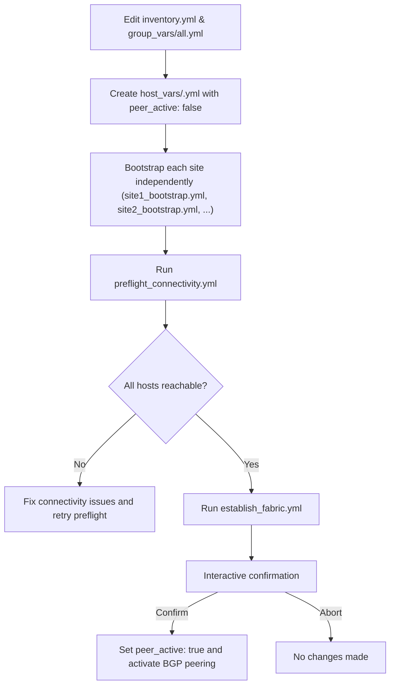

```mermaid
flowchart TD
    A["Edit inventory.yml & group_vars/all.yml"] --> B["Create host_vars/<hostname>.yml with peer_active: false"]
    B --> C["Bootstrap each site independently (site1_bootstrap.yml, site2_bootstrap.yml, ...)"]
    C --> D["Run preflight_connectivity.yml"]
    D --> E{"All hosts reachable?"}
    E -- No --> F["Fix connectivity issues and retry preflight"]
    E -- Yes --> G["Run establish_fabric.yml"]
    G --> H["Interactive confirmation"]
    H -- Confirm --> I["Set peer_active: true and activate BGP peering"]
    H -- Abort --> J["No changes made"]
```
