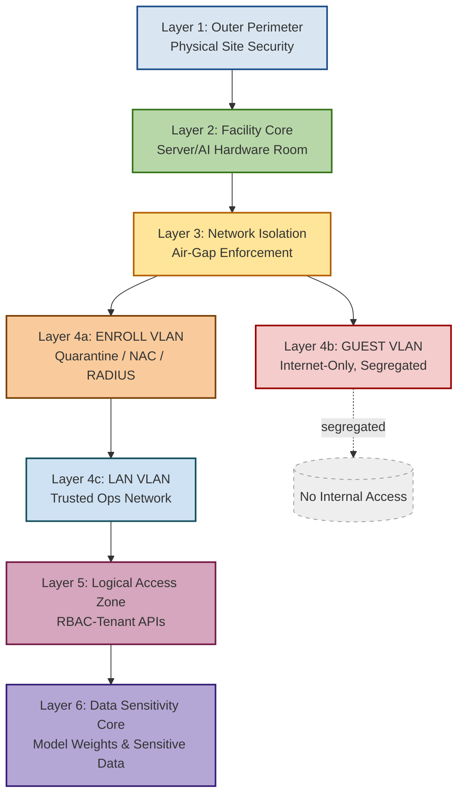
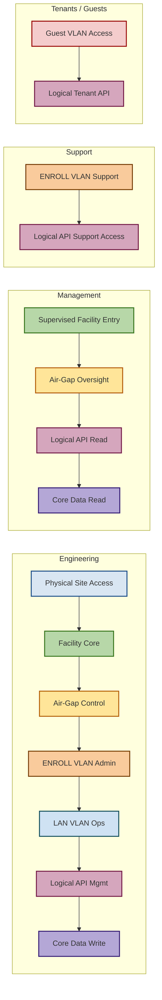

# edgesec-SDN

<table>
  <tr>
    <td align="left" valign="top" style="min-width:240px;">
      This directory contains playbooks, Docker Compose files, and documentation for the edgesec-SDN (Software Defined Networking) automation stack.
    </td>
    <td align="right" valign="top">
      
    </td>
  </tr>
</table>

## Playbooks

Located in `playbooks/`:
- `provision_network.yml`: Main SDN fabric provisioning playbook.
- `site1_bootstrap.yml`, `site2_bootstrap.yml`, `site3_bootstrap.yml`: Per-site bootstrap playbooks for multi-site SDN deployment.
- `preflight_connectivity.yml`: Checks connectivity between all Proxmox nodes before BGP peering.
- `establish_fabric.yml`: Interactive BGP peering and fabric activation.

## Docker Compose

Place SDN-related Docker Compose files in the `docker/` subdirectory. Each file should be named and documented for its specific purpose (e.g., `docker-compose.sdn.yml`).

## Usage

1. Edit inventory and config files as needed.
2. Run playbooks from the `playbooks/` directory.
3. Use Docker Compose files from the `docker/` directory for SDN-related services.

See the main repo README and `Fabric_bootstrap.md` for more details.

## Security Model

<strong>Defense-in-Depth Security Model (click to expand)</strong>

<strong>RBAC-to-DiD Mapping (click to expand)</strong>

[6:33 p.m.] Christopher Peterson
| **Zone / Layer**                               | **Engineering**   | **Management**   | **Support**   | **Tenants / Guests** |
|-----------------------------------------------|-------------------|------------------|---------------|----------------------|
| Outer Perimeter (Physical)                    | ✅ Full           | ❌               | ❌            | ❌                   |
| Facility Core (Server/AI Room)                | ✅ Full           | ✅ Supervised    | ❌            | ❌                   |
| Network Isolation (Air‑Gap)                   | ✅ Admin          | ✅ Oversight     | ❌            | ❌                   |
| ENROLL VLAN (Quarantine)                      | ✅ Admin          | ❌               | ✅ Support    | ❌                   |
| GUEST VLAN (Internet‑Only)                    | ❌                | ❌               | ❌            | ✅                   |
| LAN VLAN (Trusted Ops)                        | ✅ Ops            | ❌               | ❌            | ❌                   |
| Logical Access Zone (RBAC APIs)               | ✅ Admin/Mgmt     | ✅ Read          | ✅ Support    | ✅ Tenant API        |
| Data Sensitivity Core (Weights/Data)          | ✅ Write/Manage   | ✅ Read          | ❌            | ❌                   |
 

## Future Integration:

The edgesec-SDN automation platform is designed for seamless integration with organizational intelligence and external APIs. Planned future integrations include:

- **edgesec-REST:**
  - Centralizes all SDN decisions (subnet selection, VXLAN ID, firewall rules) using AI-driven and organizational policy logic.
  - Ansible playbooks will query edgesec-REST for dynamic recommendations, ensuring compliance, agility, and security.
  - Enables policy-driven, real-time automation—playbooks become thin clients executing org-approved actions.

- **Netbox:**
  - Used for authoritative IPAM, device, and network topology data.
  - Playbooks will register, update, or decommission resources in Netbox as part of the workflow.

- **Netbird API:**
  - Automates remote access provisioning for users and devices.
  - Playbooks will request, manage, and revoke secure remote access via Netbird, as directed by edgesec-REST or org policy.

**Benefits:**
- Centralized, AI-augmented decision-making for all SDN actions.
- Consistent, policy-compliant automation across the organization.
- Rapid adaptation to changing org needs—update logic in edgesec-REST, not in every playbook.
- Full auditability and security for all automated actions.
