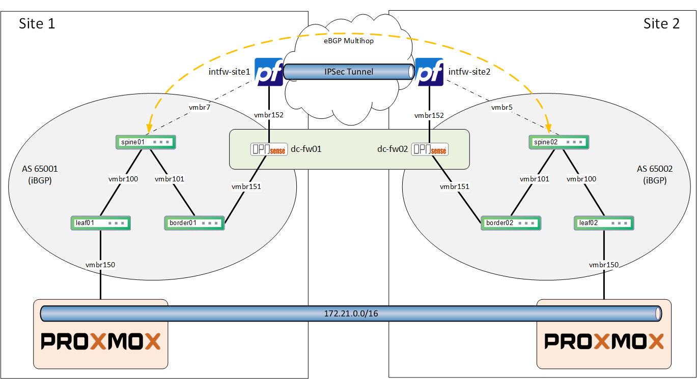
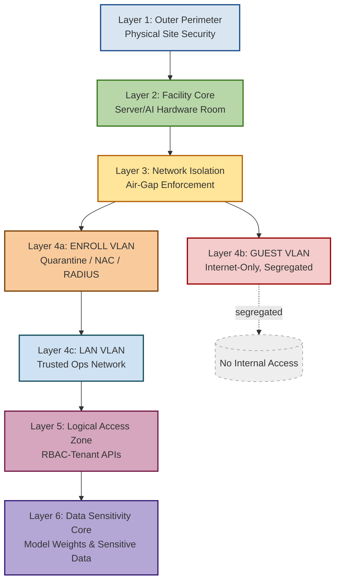
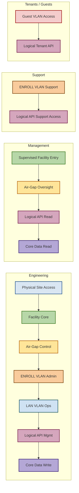

# edgesec-SDN

**Multi-site Deployment**
  - `site1_bootstrap.yml`, `site2_bootstrap.yml`, `site3_bootstrap.yml`: Per-site bootstrap playbooks <tr>
    <**📖 [Complete NFTables Role Documentation](../../roles/nftables/README.md)**

### 🔒 NFTables Bridge Isolation (Phase 1)
**Purpose**: Implement bridge-level access control and tenant isolation using the nftables role during Phase 1 setup.

**Key Features**:
- **Bridge Access Control**: Enforce traffic policies between SDN bridges at the kernel level
- **Tenant Isolation**: Prevent direct communication between tenant (vmbr1) and gateway (vmbr2) bridges
- **Management Bridge Priority**: vmbr99 (Management) maintains full bidirectional access to all bridges
- **Performance-Optimized**: nftables rules applied directly at bridge interfaces for low latency

**Bridge Security Matrix**:
```
Traffic Flow Matrix:
Source → Destination | vmbr99 (Mgmt) | vmbr1 (Tenant) | vmbr2 (Gateway)
vmbr99 (Mgmt)       | ✅ Allowed     | ✅ Allowed     | ✅ Allowed
vmbr1 (Tenant)      | ✅ Allowed     | ✅ Allowed     | ❌ Blocked
vmbr2 (Gateway)     | ✅ Allowed     | ❌ Blocked     | ✅ Allowed
```

**Integration with Phase 1**:
- Automatically applied during `provision_complete_sdn.yml` execution
- Uses the nftables role with `nftables_configure_bridges: true` variable
- Creates bridge-specific rule files in `/etc/nftables.d/` directory
- Enables IPv4/IPv6 forwarding for proper routing functionality

**Usage Examples**:

*Enable Bridge Isolation in Complete Setup:*
```bash
# Run full SDN with bridge access control (default behavior)
ansible-playbook -i ../../inventory playbooks/provision_complete_sdn.yml
```

*Standalone Bridge Rules Setup:*
```bash
# Apply only NFTables bridge isolation rules
ansible-playbook -i ../../inventory playbooks/nftables_bridge_rules.yml
```

*Disable Bridge Isolation:*
```bash
# Run SDN setup without bridge access control
ansible-playbook -i ../../inventory playbooks/provision_complete_sdn.yml -e "nftables_configure_bridges=false"
```

**Future: Inter-VXLAN Rules**:
When the fabric is established (Phase 3+), additional nftables rules will be introduced for:
- Inter-VXLAN traffic filtering and policy enforcement
- Tenant-to-tenant communication controls
- External access and perimeter security
- Advanced microsegmentation beyond bridge isolation

### 🔍 Phase 2: Connectivity Check (`preflight_connectivity.yml`)align="left" valign="top" style="min-width:240px;">
      This directory contains playbooks, Docker Compose files, and documentation for the edgesec-SDN (Software Defined Networking) automation stack.
    </td>
    <td align="right" valign="top">
      
    </td>
  </tr>
</table>

## Playbooks
Located in `playbooks/`:

**Phase 1: Single Node VXLAN Setup**
  - `provision_network.yml`: Creates VLAN-aware bridges and SDN zones
  - `setup_complete_sdn.yml`: Complete SDN infrastructure (VXLAN bridges + connectivity verification)

**Phase 2: Connectivity Verification**
  - `preflight_connectivity.yml`: Verifies reachability between nodes before fabric finalization

**Phase 3: Fabric Finalization**
  - `establish_fabric.yml`: Establishes VNI mappings and finalizes EVPN overlays

**Complete SDN Provisioning**
  - `provision_complete_sdn.yml`: **RECOMMENDED** - Full SDN setup with NFTables (network_provision → vxlan → nftables roles)

**Utilities**
  - `provision.yml`: Basic node provisioning (prerequisites + network interface setup)
  - `nftables_bridge_rules.yml`: Standalone NFTables bridge access control setup

## Playbooks - TO BE DEPRECATED

Located in `playbooks/`:
- `provision.yml`: Basic node provisioning (prerequisites + network interface setup)
- `provision_network.yml`: **Phase 1** - Single node VXLAN setup, creates VLAN-aware bridges and SDN zones
- `setup_complete_sdn.yml`: **Phases 1-2** - Complete SDN infrastructure (VXLAN bridges + connectivity verification)
- `provision_complete_sdn.yml`: **RECOMMENDED** - Complete SDN provisioning with NFTables (network_provision → vxlan → nftables roles)
- `preflight_connectivity.yml`: **Phase 2** - Connectivity verification between nodes before fabric finalization
- `establish_fabric.yml`: **Phase 3** - Fabric finalization with VNI mappings and EVPN overlay establishment
- `nftables_bridge_rules.yml`: Standalone NFTables bridge access control setup
- `site1_bootstrap.yml`, `site2_bootstrap.yml`, `site3_bootstrap.yml`: Per-site bootstrap playbooks for multi-site SDN deployment

## Multi-Phase SDN Provisioning Process

This SDN implementation follows a structured 3-phase approach using Proxmox VE 9's pvesh API for reliable SDN deployment:

### 🏗️ Phase 1: Single Node VXLAN Setup (`provision_network.yml`)
**Purpose**: Provision local bridges and SDN infrastructure on individual nodes.

**Key Actions**:
- Create VLAN-aware SDN bridges (vmbr99: Management, vmbr1: Tenant, vmbr2: Gateway)
- Establish SDN fabric and EVPN controller
- Create SDN zones and VNets
- Apply network and SDN configuration changes

**Usage Examples**:

**Complete SDN Setup** (Recommended):
```bash
# Run full SDN infrastructure setup with NFTables (network_provision + vxlan + nftables)
ansible-playbook -i ../../inventory playbooks/provision_complete_sdn.yml
```

**Basic SDN Setup** (Phases 1-2):
```bash
# Setup VXLAN bridges and connectivity verification
ansible-playbook -i ../../inventory playbooks/setup_complete_sdn.yml
```

**Bridge-Only Setup**:
```bash
# Setup only network bridges (legacy provision_network.yml)
ansible-playbook -i ../../inventory playbooks/provision_network.yml
```

**Basic Provisioning**:
```bash
# Basic node setup (prerequisites + network interfaces)
ansible-playbook -i ../../inventory playbooks/provision.yml
```

**Single Node Testing**:
```bash
# Test on specific node with verbose output
ansible-playbook -i ../../inventory playbooks/provision_complete_sdn.yml --limit pve-node1 -v
```

**Dry Run Check**:
```bash
# Validate playbook syntax and logic without changes
ansible-playbook -i ../../inventory playbooks/provision_complete_sdn.yml --check
```

**📖 [Detailed VXLAN Role Documentation](../../roles/vxlan/README.md)**

### � NFTables Role: Bridge Access Control
**Purpose**: Provides firewall rules and tenant isolation for SDN bridge security.

**Key Features**:
- Bridge access control with tenant separation
- Management bridge (vmbr99) has full access to all bridges
- Tenant bridge (vmbr1) restricted to management only (isolated from vmbr2)
- Gateway bridge (vmbr2) restricted to management only (isolated from vmbr1)
- IPv4/IPv6 forwarding and basic firewall policies

**Usage Examples:**

*Complete SDN with NFTables (Recommended):*
```bash
# Single-command complete SDN setup with bridge access control
ansible-playbook -i ../../inventory playbooks/provision_complete_sdn.yml
```

*Limit to Specific Nodes:*
```bash
# Deploy SDN with NFTables to specific Proxmox nodes
ansible-playbook -i ../../inventory playbooks/provision_complete_sdn.yml --limit proxmox-node-1,proxmox-node-2
```

*Disable NFTables for Basic SDN Only:*
```bash
# Run SDN setup without bridge access control rules
ansible-playbook -i ../../inventory playbooks/provision_complete_sdn.yml -e "nftables_configure_bridges=false"
```

*Standalone NFTables Role:*
```yaml
# Include nftables role in your playbook for firewall management
- hosts: proxmox-hosts
  roles:
    - role: nftables
      nftables_configure_bridges: true
```

*Custom Bridge Access Control:*
```yaml
# Override default bridge isolation policies
- hosts: proxmox-hosts
  vars:
    nftables_configure_bridges: true
    nftables_bridge_access_control:
      vmbr99:
        allowed_peers: ["vmbr1", "vmbr2"]
      vmbr1:
        allowed_peers: ["vmbr99"]
        blocked_peers: ["vmbr2"]
  roles:
    - nftables
```

**📖 [Complete NFTables Role Documentation](../../roles/nftables/README.md)**

### �🔍 Phase 2: Connectivity Check (`preflight_connectivity.yml`)
**Purpose**: Verify reachability and configuration before cluster-wide fabric activation.

**Key Actions**:
- Ping test all Proxmox nodes
- Check FRR BGP session status
- Verify network interfaces and bridge status
- Validate SDN configuration existence

**Command Example**:
```bash
ansible-playbook -i ../../inventory playbooks/preflight_connectivity.yml
```

### 🧱 Phase 3: Fabric Finalization (`establish_fabric.yml`)
**Purpose**: Establish VNI mappings and finalize EVPN overlays across the cluster.

**Key Actions**:
- Add node interfaces to SDN fabric
- Create SDN subnets (optional)
- Apply final SDN configuration
- Test VNet connectivity

**Command Example**:
```bash
ansible-playbook -i ../../inventory playbooks/establish_fabric.yml
```

### 📋 SDN Architecture Overview

- **Bridges**: vmbr99 (Management), vmbr1 (Tenant), vmbr2 (Gateway)
- **Fabric**: OpenFabric-based SDN with EVPN controller
- **Zones**: tenant-zone (VRF-VXLAN 100), gateway-zone (VRF-VXLAN 200)
- **VNets**: tenant-vnet (VLAN 10), gateway-vnet (VLAN 20)
- **Controller**: EVPN core with ASN 65000

### ⚠️ Important Notes

- Always run interface pinning **before** SDN operations
- Use `bridge_vlan_aware yes` for all SDN bridges
- Apply changes with `pvesh set /nodes/localhost/network` and `pvesh set /cluster/sdn`
- Avoid VLAN subinterfaces (vmbr0.10) as bridge ports
- Test connectivity between phases to ensure reliability

## Docker Compose

Place SDN-related Docker Compose files in the `docker/` subdirectory. Each file should be named and documented for its specific purpose (e.g., `docker-compose.sdn.yml`).

## Usage

### Multi-Phase SDN Deployment

Follow this structured 3-phase approach for reliable SDN deployment:

#### Phase 1: Single Node Setup
```bash
# Provision local bridges and SDN infrastructure on individual nodes
ansible-playbook -i ../../inventory playbooks/provision_network.yml

# Optional: Limit to specific nodes
ansible-playbook -i ../../inventory playbooks/provision_network.yml --limit proxmox-node-1
```

#### Phase 2: Connectivity Verification
```bash
# Verify reachability between nodes before fabric finalization
ansible-playbook -i ../../inventory playbooks/preflight_connectivity.yml

# Check specific node connectivity
ansible-playbook -i ../../inventory playbooks/preflight_connectivity.yml --limit proxmox-node-1
```

#### Phase 3: Fabric Finalization
```bash
# Establish VNI mappings and finalize EVPN overlays
ansible-playbook -i ../../inventory playbooks/establish_fabric.yml

# Apply to specific nodes only
ansible-playbook -i ../../inventory playbooks/establish_fabric.yml --limit proxmox-node-1,proxmox-node-2
```

### Complete SDN Provisioning with NFTables (`provision_complete_sdn.yml`)
**Purpose**: Single-command complete SDN infrastructure setup with bridge access control.

**What it does**:
- **network_provision role**: Interface discovery, naming, pinning, and bridging
- **vxlan role**: SDN controllers, zones, VNets, and bridge configuration  
- **nftables role**: Bridge access control with tenant isolation

**Usage**:
```bash
# Complete SDN setup with NFTables bridge access control
ansible-playbook -i ../../inventory playbooks/provision_complete_sdn.yml

# Limit to specific nodes
ansible-playbook -i ../../inventory playbooks/provision_complete_sdn.yml --limit proxmox-node-1

# Disable NFTables (just network + SDN setup)
ansible-playbook -i ../../inventory playbooks/provision_complete_sdn.yml -e "nftables_configure_bridges=false"
```

**Security Model**:
- Management bridge (vmbr99): Full access to all tenant/gateway bridges
- Tenant bridge (vmbr1): Restricted to management only (isolated from vmbr2)
- Gateway bridge (vmbr2): Restricted to management only (isolated from vmbr1)

**📖 [Complete NFTables Role Documentation](../../roles/nftables/README.md)**

### Advanced Usage Examples

#### Dry Run Testing
```bash
# Test playbook syntax and logic without making changes
ansible-playbook -i ../../inventory playbooks/provision_network.yml --check

# Show what would be changed
ansible-playbook -i ../../inventory playbooks/provision_network.yml --check --diff
```

#### Verbose Output
```bash
# Run with detailed output for troubleshooting
ansible-playbook -i ../../inventory playbooks/provision_network.yml -v

# Maximum verbosity
ansible-playbook -i ../../inventory playbooks/provision_network.yml -vvv
```

#### Selective Execution
```bash
# Run only specific tags
ansible-playbook -i ../../inventory playbooks/provision_network.yml --tags bridges

# Skip specific tags
ansible-playbook -i ../../inventory playbooks/provision_network.yml --skip-tags verification
```

#### Parallel Execution
```bash
# Run on multiple nodes simultaneously (default)
ansible-playbook -i ../../inventory playbooks/provision_network.yml

# Limit parallelism
ansible-playbook -i ../../inventory playbooks/provision_network.yml --forks 2
```

#### VXLAN Connectivity Verification
```bash
# Trigger VXLAN connectivity checks after SDN setup
ansible-playbook -i ../../inventory playbooks/setup_complete_sdn.yml -e "run_verification=true"

# Check VXLAN interfaces and FDB entries
ansible-playbook -i ../../inventory playbooks/setup_complete_sdn.yml --tags "verify_vxlan_connectivity"
```

#### Complete SDN with NFTables
```bash
# Single-command complete SDN setup with bridge access control
ansible-playbook -i ../../inventory playbooks/provision_complete_sdn.yml

# Disable NFTables for basic SDN setup only
ansible-playbook -i ../../inventory playbooks/provision_complete_sdn.yml -e "nftables_configure_bridges=false"
```

### Tenant Management

The nftables role supports granular tenant isolation and policy enforcement. Bridge access control is now handled by the dedicated nftables role.

#### Tenant Variables Structure (in nftables role)
```yaml
nftables_configure_bridges: true
nftables_bridge_access_control:
  vmbr99:
    allowed_peers: ["vmbr1", "vmbr2"]
  vmbr1:
    allowed_peers: ["vmbr99"]
    blocked_peers: ["vmbr2"]
```

#### Features
- **Ingress/Egress Control**: Separate rules for traffic entering and leaving bridges
- **Tenant Isolation**: Network segmentation between tenants
- **Bridge-Specific Rules**: Individual firewall policies per SDN bridge
- **JSON Configuration**: Structured policy definitions for access control

**📖 [Detailed NFTables Role Documentation](../../roles/nftables/README.md)**

### Prerequisites

1. **Interface Pinning**: Ensure network interfaces are properly pinned before SDN operations
2. **Inventory Setup**: Configure your `inventory` file with correct host groups and variables
3. **SSH Access**: Verify SSH connectivity to all Proxmox nodes
4. **Permissions**: Ensure Ansible has sudo privileges on target nodes

### Troubleshooting

#### Common Issues
- **"Pending changes" in Proxmox GUI**: Run `pvesh set /nodes/localhost/network` to apply changes
- **Bridge not active**: Ensure `-autostart yes` parameter is used
- **VLAN issues**: Verify `bridge_vlan_aware yes` is set on all SDN bridges
- **Connectivity failures**: Check physical network connections and interface pinning

#### Verification Commands
```bash
# Check bridge status
ip -br link show type bridge

# Verify SDN configuration
pvesh get /cluster/sdn

# Check network configuration
pvesh get /nodes/localhost/network

# Test BGP sessions (if using FRR)
vtysh -c "show bgp summary"
```

### Docker Compose Integration

1. Edit inventory and config files as needed.
2. Run playbooks from the `playbooks/` directory.
3. Use Docker Compose files from the `docker/` directory for SDN-related services.

See the main repo README and `Fabric_bootstrap.md` for more details.


## Security Model

<details>
<summary><strong>Defense-in-Depth Security Model (click to expand)</strong></summary>




</details>

<details>
<summary><strong>RBAC-to-DiD Mapping (click to expand)</strong></summary>



</details>

| **Zone / Layer**                               | **Engineering**   | **Management**   | **Support**   | **Tenants / Guests** |
|-----------------------------------------------|-------------------|------------------|---------------|----------------------|
| Outer Perimeter (Physical)                    | ✅ Full           | ❌               | ❌            | ❌                   |
| Facility Core (Server/AI Room)                | ✅ Full           | ✅ Supervised    | ❌            | ❌                   |
| Network Isolation (Air‑Gap)                   | ✅ Admin          | ✅ Oversight     | ❌            | ❌                   |
| ENROLL VLAN (Quarantine)                      | ✅ Admin          | ❌               | ✅ Support    | ❌                   |
| GUEST VLAN (Internet‑Only)                    | ❌                | ❌               | ❌            | ✅                   |
| LAN VLAN (Trusted Ops)                        | ✅ Ops            | ❌               | ❌            | ❌                   |
| Logical Access Zone (RBAC APIs)               | ✅ Admin/Mgmt     | ✅ Read          | ✅ Support    | ✅ Tenant API        |
| Data Sensitivity Core (Weights/Data)          | ✅ Write/Manage   | ✅ Read          | ❌            | ❌                   |
 

## Future Integration:

The edgesec-SDN automation platform is designed for seamless integration with organizational intelligence and external APIs. Planned future integrations include:

- **edgesec-REST:**
  - Centralizes all SDN decisions (subnet selection, VXLAN ID, firewall rules) using AI-driven and organizational policy logic.
  - Ansible playbooks will query edgesec-REST for dynamic recommendations, ensuring compliance, agility, and security.
  - Enables policy-driven, real-time automation—playbooks become thin clients executing org-approved actions.

- **Netbox:**
  - Used for authoritative IPAM, device, and network topology data.
  - Playbooks will register, update, or decommission resources in Netbox as part of the workflow.

- **Netbird API:**
  - Automates remote access provisioning for users and devices.
  - Playbooks will request, manage, and revoke secure remote access via Netbird, as directed by edgesec-REST or org policy.

**Benefits:**
- Centralized, AI-augmented decision-making for all SDN actions.
- Consistent, policy-compliant automation across the organization.
- Rapid adaptation to changing org needs—update logic in edgesec-REST, not in every playbook.
- Full auditability and security for all automated actions.
