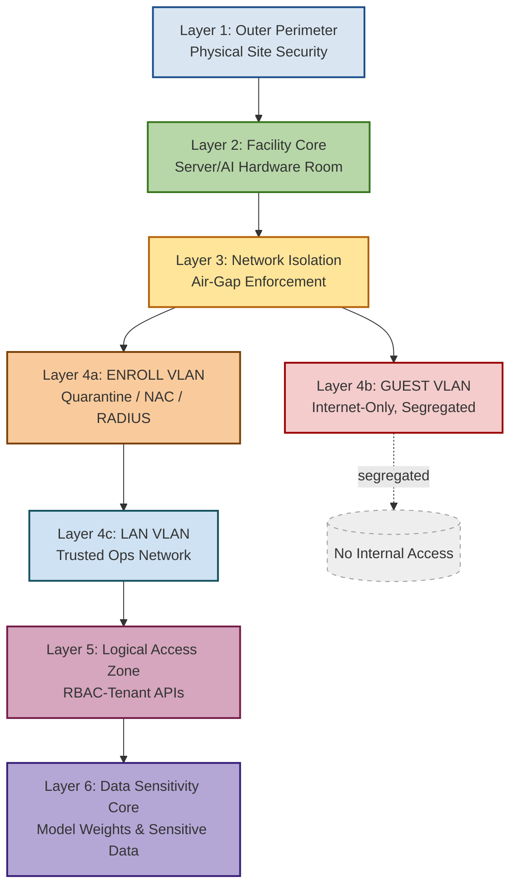
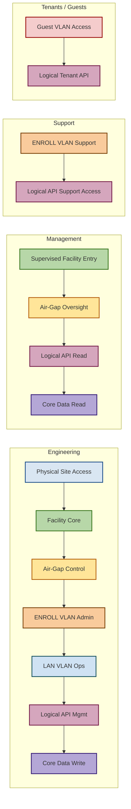

# edgesec-SDN
**Multi-site Deployment**
  - `site1_bootstrap.yml`, `site2_bootstrap.yml`, `site3_bootstrap.yml`

This README is a focused, practical guide showing the *safe, staged workflow* to run
the Phase‑1 provisioning playbook (`playbooks/provision.yml`) against a single node
(`pve1`) in this repository. It assumes you already explored the code and ran
earlier experiments; follow the stages below to avoid surprises and preserve SSH.

Prerequisites
 - Clone of this repo and a working Python/Ansible environment
 - Inventory file at the repo root (`inventory`) with `pve1.comwell.edgesec.ca`
 - SSH access to `pve1` with sudo privileges
 - IPMI/console access available as a fallback (recommended)

Important safety defaults
 - Backups of `/etc/network/interfaces` will be written to `/opt/backup` on the host.
 - The project provides `scripts/guarded_ifreload.sh` to validate and rollback invalid
   interface writes — handlers should call it where risk exists.
 - The management bridge (`vmbr0`) and its IP are preserved by the playbooks — do not
   remove or change them manually while running provisioning.

Staged workflow (recommended)
1) Preflight locally (on your control host)

```bash
# fetch latest repo changes
git fetch origin && git checkout fix/pvesh-safety-and-params && git pull

# Optional: ansible-lint and yamllint (install into your venv if missing)
pip install -r requirements-dev.txt || true
ansible-lint edgesec-sdn/playbooks/provision.yml || echo "ansible-lint issues (review)"

# Syntax check the playbook
ansible-playbook --syntax-check edgesec-sdn/playbooks/provision.yml

# Quick inventory reachability check for pve1
ansible -i inventory -m ping -u cpadmin --limit pve1.comwell.edgesec.ca
```

2) Stage 1 — dry-run check-mode (preview what will change on pve1)

Use the same tags and extra-vars we use in live runs. This only previews changes.

```bash
ansible-playbook -i inventory edgesec-sdn/playbooks/provision.yml \
  --limit pve1.comwell.edgesec.ca \
  --tags "deploy_linux_bridges,deploy_ovs_bridges,deploy_sdn_vxlan,establish_glue" \
  -e "write_interfaces_file=true ovs_create=true force_ovsclean=false reboot_action=none" \
  --check --diff
````markdown
# edgesec-SDN — operational guide (focused)

This file is a concise, practical operator guide for safely running the Phase‑1
provisioning flows and the newer helper playbooks/scripts added in branch
`fix/pvesh-safety-and-params`.

Goal
 - Provide a safety-first, staged workflow that preserves operator-managed iface
   stanzas, validates interface files before reload, and falls back to OVS VXLAN
   when the Proxmox SDN API cannot be used.

Prerequisites
 - Repo clone and active Python/Ansible environment (see `requirements-dev.txt`).
 - Inventory at the repo root and SSH access to target nodes with sudo (example
   host: `pve1.comwell.edgesec.ca`).
 - Console/IPMI available as fallback when performing network reloads.

Quick highlights (what changed)
 - Guarded reload: `scripts/guarded_ifreload.sh` — backup, validate, reload, and
   restore on failure. Handlers should call this script instead of unguarded
   `ifreload -a` where possible.
 - Templates fixed: avoid emitting empty `vlan-raw-device` lines that caused
   `ifreload -a` parse errors.
 - OVS VXLAN fallback: when pvesh/SDN API calls fail or are incompatible, the
   playbooks will optionally create idempotent OVS vxlan ports as a fallback.
 - New helper playbooks:
   - `playbooks/persist_bridge_ips.yml` — write bridge gateway fragments to
     `/etc/network/interfaces.d/` and optionally run guarded reload; persists
     `host_vars/<host>/vxlan_gateways.yml` to keep the mapping in inventory.
   - `playbooks/create_test_vms.yml` — clone a cloud-init template, inject
     `ipconfigN` values and start test VMs for connectivity tests.
   - `playbooks/provision_staged.yml` — helper for a check → apply → verify
     staged run with conservative defaults.

Backups & Recovery
 - All interface writes and important changes are backed up to `/opt/backup` on
   the target host. `scripts/guarded_ifreload.sh` attempts a restore when a
   reload would leave the host with an invalid `/etc/network/interfaces`.
 - Always keep console/IPMI available during reloads. The guarded script helps
   but cannot recover from every possible failure without physical access.

How to run (recommended staged flow)

1) Preflight locally

```bash
# Checkout the branch with the safety improvements (example)
git fetch origin && git checkout fix/pvesh-safety-and-params && git pull

# Syntax check and lightweight lint (optional)
ansible-playbook --syntax-check playbooks/provision.yml
ansible -i inventory -m ping --limit pve1.comwell.edgesec.ca
```

2) Dry-run (preview)

```bash
ansible-playbook -i inventory playbooks/provision.yml \
  --limit pve1.comwell.edgesec.ca \
  --tags "deploy_linux_bridges,deploy_ovs_bridges,deploy_sdn_vxlan,establish_glue" \
  -e "write_interfaces_file=true ovs_create=true force_ovsclean=false reboot_action=none" \
  --check --diff
```

3) Apply (targeted)

```bash
ansible-playbook -i inventory playbooks/provision.yml \
  --limit pve1.comwell.edgesec.ca \
  --tags "deploy_linux_bridges,deploy_ovs_bridges,deploy_sdn_vxlan,establish_glue" \
  -e "write_interfaces_file=true ovs_create=true force_ovsclean=false reboot_action=none"
```

Notes about flags
 - `write_interfaces_file=true` — render and write fragments (gated by default).
 - `ovs_create=true` — create OVS bridges/ports at runtime (opt-in).
 - `force_ovsclean=false` — do not perform aggressive host-side OVS cleanup
   unless you understand the effect and have console fallback.

4) Verification

```bash
ansible -i inventory -u cpadmin --limit pve1.comwell.edgesec.ca -m shell -a "cat /etc/network/interfaces"
ansible -i inventory -u cpadmin --limit pve1.comwell.edgesec.ca -m shell -a "ls -l /etc/network/interfaces.d"
ansible -i inventory -u cpadmin --limit pve1.comwell.edgesec.ca -m shell -a "ovs-vsctl show"
```

Persisting bridge gateway IPs (helper)
 - To write a small interfaces.d fragment with bridge gateway addresses and
   optionally reload networking use `playbooks/persist_bridge_ips.yml`.

Example (persist and guarded reload):

```bash
ansible-playbook -i inventory playbooks/persist_bridge_ips.yml \
  -e "target=pve1.comwell.edgesec.ca" -e do_reload=true
```

This playbook will also write `host_vars/pve1.comwell.edgesec.ca/vxlan_gateways.yml`
on the controller so future runs are idempotent and the mapping is preserved in
inventory.

Create test VMs (helper)
 - Use `playbooks/create_test_vms.yml` to clone a cloud-init template and inject
   static `ipconfigN` values for quick in-host verification of VXLAN/OVS bridging.

Example:

```bash
ansible-playbook -i inventory playbooks/create_test_vms.yml --limit pve1.comwell.edgesec.ca \
  -e "template_vmid=8000 vm_base=200 vm_count=3"
```

Safety notes
 - Console/IPMI must be available for nodes when running `do_reload=true`.
 - Backups live under `/opt/backup` on the target host; inspect them if a
   guarded reload reports an error.
 - If you discover `ifreload -a` parse errors after a change, inspect the
   offending fragment for empty `vlan-raw-device` lines; the templates in this
   branch avoid producing those lines.

Files of interest
 - scripts/guarded_ifreload.sh — guarded interface reload with backup/restore
 - scripts/remove_veths_prep.sh — runtime cleanup helper used before reloads
 - playbooks/persist_bridge_ips.yml — persist bridge gateway IPs + guarded reload
 - playbooks/create_test_vms.yml — clone cloud-init template + inject ipconfigN
 - playbooks/provision_staged.yml — convenience wrapper for check → apply → verify
 - roles/network_provision/templates/linux_bridges_interfaces.j2 — template fixed
   to omit empty `vlan-raw-device` lines

Branch / changelog
 - The safety and guard improvements are in branch `fix/pvesh-safety-and-params`.
 - Changes include: guarded-ifreload, templates fix, OVS fallback for VXLAN
   creation, test VM playbook, and the persist-bridge-ips helper.

If you'd like, I can also:
 - Replace any remaining direct `ifreload -a` handlers with calls to
   `scripts/guarded_ifreload.sh` across all roles (low-risk automation).
 - Add a small verification playbook that consumes `host_vars/*/vxlan_gateways.yml`
   to automatically verify host↔VM adjacency after writes.

---

Maintainers: keep the older, more detailed SDN documentation in
`edgesec-sdn/README.md.bak` and update this operational guide for on-call and
day-to-day provisioning tasks.

````

**Key Actions**:
- Create VLAN-aware SDN bridges (vmbr99: Management, vmbr1: Tenant, vmbr2: Gateway)
- Establish SDN fabric and EVPN controller
- Create SDN zones and VNets
- Apply network and SDN configuration changes

**Usage Examples**:

**Complete SDN Setup** (Recommended):
```bash
# Run full SDN infrastructure setup with NFTables (network_provision + vxlan + nftables)
ansible-playbook -i ../../inventory playbooks/provision_complete_sdn.yml
```

**Basic SDN Setup** (Phases 1-2):
```bash
# Setup VXLAN bridges and connectivity verification
ansible-playbook -i ../../inventory playbooks/setup_complete_sdn.yml
```

**Bridge-Only Setup**:
```bash
# Setup only network bridges (legacy provision_network.yml)
ansible-playbook -i ../../inventory playbooks/provision_network.yml
```

**Basic Provisioning**:
```bash
# Basic node setup (prerequisites + network interfaces)
ansible-playbook -i ../../inventory playbooks/provision.yml
```

**Single Node Testing**:
```bash
# Test on specific node with verbose output
ansible-playbook -i ../../inventory playbooks/provision_complete_sdn.yml --limit pve-node1 -v
```

**Dry Run Check**:
```bash
# Validate playbook syntax and logic without changes
ansible-playbook -i ../../inventory playbooks/provision_complete_sdn.yml --check
```

**📖 [Detailed VXLAN Role Documentation](../../roles/vxlan/README.md)**

### � NFTables Role: Bridge Access Control
**Purpose**: Provides firewall rules and tenant isolation for SDN bridge security.

**Key Features**:
- Bridge access control with tenant separation
- Management bridge (vmbr99) has full access to all bridges
- Tenant bridge (vmbr1) restricted to management only (isolated from vmbr2)
- Gateway bridge (vmbr2) restricted to management only (isolated from vmbr1)
- IPv4/IPv6 forwarding and basic firewall policies

**Usage Examples:**

*Complete SDN with NFTables (Recommended):*
```bash
# Single-command complete SDN setup with bridge access control
ansible-playbook -i ../../inventory playbooks/provision_complete_sdn.yml
```

*Limit to Specific Nodes:*
```bash
# Deploy SDN with NFTables to specific Proxmox nodes
ansible-playbook -i ../../inventory playbooks/provision_complete_sdn.yml --limit proxmox-node-1,proxmox-node-2
```

*Disable NFTables for Basic SDN Only:*
```bash
# Run SDN setup without bridge access control rules
ansible-playbook -i ../../inventory playbooks/provision_complete_sdn.yml -e "nftables_configure_bridges=false"
```

*Standalone NFTables Role:*
```yaml
# Include nftables role in your playbook for firewall management
- hosts: proxmox-hosts
  roles:
    - role: nftables
      nftables_configure_bridges: true
```

*Custom Bridge Access Control:*
```yaml
# Override default bridge isolation policies
- hosts: proxmox-hosts
  vars:
    nftables_configure_bridges: true
    nftables_bridge_access_control:
      vmbr99:
        allowed_peers: ["vmbr1", "vmbr2"]
      vmbr1:
        allowed_peers: ["vmbr99"]
        blocked_peers: ["vmbr2"]
  roles:
    - nftables
```
**NFTables Bridge Rules Usage Examples:**

*Complete SDN with Bridge Isolation:*
```bash
# Deploy full SDN infrastructure with NFTables bridge access control
ansible-playbook -i ../../inventory playbooks/provision_complete_sdn.yml
```

*Standalone NFTables Bridge Rules:*
```bash
# Apply only NFTables bridge isolation rules to existing SDN setup
ansible-playbook -i ../../inventory playbooks/nftables_bridge_rules.yml
```

*Custom Bridge Access Policies:*
```yaml
# Include nftables role with custom bridge isolation in your playbook
- hosts: proxmox-hosts
  vars:
    nftables_configure_bridges: true
    nftables_bridge_access_control:
      vmbr99:
        allowed_peers: ["vmbr1", "vmbr2"]
      vmbr1:
        allowed_peers: ["vmbr99"]
        blocked_peers: ["vmbr2"]
  roles:
    - nftables
```

**📖 [NFTables Role Documentation](../../roles/nftables/README.md)**

### �🔍 Phase 2: Connectivity Check (`preflight_connectivity.yml`)
**Purpose**: Verify reachability and configuration before cluster-wide fabric activation.

**Key Actions**:
- Ping test all Proxmox nodes
- Check FRR BGP session status
- Verify network interfaces and bridge status
- Validate SDN configuration existence

**Command Example**:
```bash
ansible-playbook -i ../../inventory playbooks/preflight_connectivity.yml
```

### 🧱 Phase 3: Fabric Finalization (`establish_fabric.yml`)
**Purpose**: Establish VNI mappings and finalize EVPN overlays across the cluster.

**Key Actions**:
- Add node interfaces to SDN fabric
- Create SDN subnets (optional)
- Apply final SDN configuration
- Test VNet connectivity

**Command Example**:
```bash
ansible-playbook -i ../../inventory playbooks/establish_fabric.yml
```

### 📋 SDN Architecture Overview

- **Bridges**: vmbr99 (Management), vmbr1 (Tenant), vmbr2 (Gateway)
- **Fabric**: OpenFabric-based SDN with EVPN controller
- **Zones**: tenant-zone (VRF-VXLAN 100), gateway-zone (VRF-VXLAN 200)
- **VNets**: tenant-vnet (VLAN 10), gateway-vnet (VLAN 20)
- **Controller**: EVPN core with ASN 65000

### ⚠️ Important Notes

- Always run interface pinning **before** SDN operations
- Use `bridge_vlan_aware yes` for all SDN bridges
- Apply changes with `pvesh set /nodes/localhost/network` and `pvesh set /cluster/sdn`
- Avoid VLAN subinterfaces (vmbr0.10) as bridge ports
- Test connectivity between phases to ensure reliability

## Docker Compose

Place SDN-related Docker Compose files in the `docker/` subdirectory. Each file should be named and documented for its specific purpose (e.g., `docker-compose.sdn.yml`).

## Usage


### Multi-Phase SDN Deployment (Modular, Role-Driven)

This SDN stack uses a modular, inventory-driven approach. All overlays, bridges, and VXLANs are defined in `group_vars/all.yml` (canonical plan) and instantiated per-node via `host_vars/` (minimal, only what is needed for each node). Roles consume these variables directly:

#### Phase 1: Single Node Setup
```bash
# Provision local bridges and SDN infrastructure on individual nodes (uses canonical overlay/VNI plan)
ansible-playbook -i ../../inventory playbooks/provision_network.yml

# Limit to specific nodes
ansible-playbook -i ../../inventory playbooks/provision_network.yml --limit pve-node1
```

#### Phase 2: Connectivity Verification
```bash
# Verify reachability between nodes before fabric finalization
ansible-playbook -i ../../inventory playbooks/preflight_connectivity.yml

# Limit to specific nodes
ansible-playbook -i ../../inventory playbooks/preflight_connectivity.yml --limit pve-node1
```

#### Phase 3: Fabric Finalization
```bash
# Establish VNI mappings and finalize EVPN overlays (uses sdn_vni_plan from group_vars)
ansible-playbook -i ../../inventory playbooks/establish_fabric.yml

# Limit to specific nodes
ansible-playbook -i ../../inventory playbooks/establish_fabric.yml --limit pve-node1,pve-node2
```

### Complete SDN Provisioning with NFTables (`provision_complete_sdn.yml`)
**Purpose**: Single-command, full SDN infrastructure setup with bridge access control.

**What it does**:
- **network_provision role**: Interface discovery, naming, pinning, and bridging (from host_vars)
- **vxlan role**: SDN controllers, zones, VNets, and bridge configuration (from group_vars and host_vars)
- **nftables role**: Bridge access control with tenant isolation (from group_vars/host_vars)

**Usage**:
```bash
# Complete SDN setup with NFTables bridge access control (uses canonical overlay/VNI plan)
ansible-playbook -i ../../inventory playbooks/provision_complete_sdn.yml

# Limit to specific nodes
ansible-playbook -i ../../inventory playbooks/provision_complete_sdn.yml --limit pve-node1

# Disable NFTables (just network + SDN setup)
ansible-playbook -i ../../inventory playbooks/provision_complete_sdn.yml -e "nftables_configure_bridges=false"
```

**Security Model**:
- Management bridge (vmbr99): Full access to all tenant/gateway bridges
- Tenant bridge (vmbr1): Restricted to management only (isolated from vmbr2)
- Gateway bridge (vmbr2): Restricted to management only (isolated from vmbr1)

**📖 [Complete NFTables Role Documentation](../../roles/nftables/README.md)**

---

## 🛠️ Maintainers' Note: Inventory Structure & Overlay Management

- **Canonical overlay/VNI plan**: Define all overlays, bridges, and VNI mappings in `group_vars/all.yml` under `sdn_vni_plan`. This is the single source of truth for the SDN fabric.
- **Per-node instantiation**: In `host_vars/<node>.yml`, only include the subinterfaces and overlays actually present on that node. Do not copy the full plan—keep it minimal for auditability and rollback.
- **Role-driven consumption**: All roles (`network_provision`, `vxlan`, `nftables`) consume these variables directly. No duplication or manual mapping is needed.
- **Best practice**: When adding or removing overlays, update `group_vars/all.yml` first, then update only the affected nodes' `host_vars` to match the new plan.
- **Documentation**: Keep diagrams and inventory in sync. Use the Mermaid diagrams and the `sdn_vni_plan` as your reference.

This structure ensures:
- Minimal, auditable, and rollback-friendly inventory
- Easy extension for new overlays or nodes
- Consistency between documentation, inventory, and deployed state

For more, see the [VXLAN Role Documentation](../../roles/vxlan/README.md) and [NFTables Role Documentation](../../roles/nftables/README.md).

### Advanced Usage Examples

#### Dry Run Testing
```bash
# Test playbook syntax and logic without making changes
ansible-playbook -i ../../inventory playbooks/provision_network.yml --check

# Show what would be changed
ansible-playbook -i ../../inventory playbooks/provision_network.yml --check --diff
```

#### Verbose Output
```bash
# Run with detailed output for troubleshooting
ansible-playbook -i ../../inventory playbooks/provision_network.yml -v

# Maximum verbosity
ansible-playbook -i ../../inventory playbooks/provision_network.yml -vvv
```

#### Selective Execution
```bash
# Run only specific tags
ansible-playbook -i ../../inventory playbooks/provision_network.yml --tags bridges

# Skip specific tags
ansible-playbook -i ../../inventory playbooks/provision_network.yml --skip-tags verification
```

#### Parallel Execution
```bash
# Run on multiple nodes simultaneously (default)
ansible-playbook -i ../../inventory playbooks/provision_network.yml

# Limit parallelism
ansible-playbook -i ../../inventory playbooks/provision_network.yml --forks 2
```

#### VXLAN Connectivity Verification
```bash
# Trigger VXLAN connectivity checks after SDN setup
ansible-playbook -i ../../inventory playbooks/setup_complete_sdn.yml -e "run_verification=true"

# Check VXLAN interfaces and FDB entries
ansible-playbook -i ../../inventory playbooks/setup_complete_sdn.yml --tags "verify_vxlan_connectivity"
```

#### Complete SDN with NFTables
```bash
# Single-command complete SDN setup with bridge access control
ansible-playbook -i ../../inventory playbooks/provision_complete_sdn.yml

# Disable NFTables for basic SDN setup only
ansible-playbook -i ../../inventory playbooks/provision_complete_sdn.yml -e "nftables_configure_bridges=false"
```

### Tenant Management

The nftables role supports granular tenant isolation and policy enforcement. Bridge access control is now handled by the dedicated nftables role.

#### Tenant Variables Structure (in nftables role)
```yaml
nftables_configure_bridges: true
nftables_bridge_access_control:
  vmbr99:
    allowed_peers: ["vmbr1", "vmbr2"]
  vmbr1:
    allowed_peers: ["vmbr99"]
    blocked_peers: ["vmbr2"]
```

#### Features
- **Ingress/Egress Control**: Separate rules for traffic entering and leaving bridges
- **Tenant Isolation**: Network segmentation between tenants
- **Bridge-Specific Rules**: Individual firewall policies per SDN bridge
- **JSON Configuration**: Structured policy definitions for access control

**📖 [Detailed NFTables Role Documentation](../../roles/nftables/README.md)**

### Prerequisites

1. **Interface Pinning**: Ensure network interfaces are properly pinned before SDN operations
2. **Inventory Setup**: Configure your `inventory` file with correct host groups and variables
3. **SSH Access**: Verify SSH connectivity to all Proxmox nodes
4. **Permissions**: Ensure Ansible has sudo privileges on target nodes

### Troubleshooting

#### Common Issues
- **"Pending changes" in Proxmox GUI**: Run `pvesh set /nodes/localhost/network` to apply changes
- **Bridge not active**: Ensure `-autostart yes` parameter is used
- **VLAN issues**: Verify `bridge_vlan_aware yes` is set on all SDN bridges
- **Connectivity failures**: Check physical network connections and interface pinning

#### Verification Commands
```bash
# Check bridge status
ip -br link show type bridge

# Verify SDN configuration
pvesh get /cluster/sdn

# Check network configuration
pvesh get /nodes/localhost/network

# Test BGP sessions (if using FRR)
vtysh -c "show bgp summary"
```

### Docker Compose Integration

1. Edit inventory and config files as needed.
2. Run playbooks from the `playbooks/` directory.
3. Use Docker Compose files from the `docker/` directory for SDN-related services.

See the main repo README and `Fabric_bootstrap.md` for more details.


## Security Model

<details>
<summary><strong>Defense-in-Depth Security Model (click to expand)</strong></summary>




</details>

<details>
<summary><strong>RBAC-to-DiD Mapping (click to expand)</strong></summary>



</details>

| **Zone / Layer**                               | **Engineering**   | **Management**   | **Support**   | **Tenants / Guests** |
|-----------------------------------------------|-------------------|------------------|---------------|----------------------|
| Outer Perimeter (Physical)                    | ✅ Full           | ❌               | ❌            | ❌                   |
| Facility Core (Server/AI Room)                | ✅ Full           | ✅ Supervised    | ❌            | ❌                   |
| Network Isolation (Air‑Gap)                   | ✅ Admin          | ✅ Oversight     | ❌            | ❌                   |
| ENROLL VLAN (Quarantine)                      | ✅ Admin          | ❌               | ✅ Support    | ❌                   |
| GUEST VLAN (Internet‑Only)                    | ❌                | ❌               | ❌            | ✅                   |
| LAN VLAN (Trusted Ops)                        | ✅ Ops            | ❌               | ❌            | ❌                   |
| Logical Access Zone (RBAC APIs)               | ✅ Admin/Mgmt     | ✅ Read          | ✅ Support    | ✅ Tenant API        |
| Data Sensitivity Core (Weights/Data)          | ✅ Write/Manage   | ✅ Read          | ❌            | ❌                   |
 
## Playbooks - TO BE DEPRECATED

Located in `playbooks/`:
- `provision.yml`: Basic node provisioning (prerequisites + network interface setup)
- `provision_network.yml`: **Phase 1** - Single node VXLAN setup, creates VLAN-aware bridges and SDN zones
- `setup_complete_sdn.yml`: **Phases 1-2** - Complete SDN infrastructure (VXLAN bridges + connectivity verification)
- `provision_complete_sdn.yml`: **RECOMMENDED** - Complete SDN provisioning with NFTables (network_provision → vxlan → nftables roles)
- `preflight_connectivity.yml`: **Phase 2** - Connectivity verification between nodes before fabric finalization
- `establish_fabric.yml`: **Phase 3** - Fabric finalization with VNI mappings and EVPN overlay establishment
- `nftables_bridge_rules.yml`: Standalone NFTables bridge access control setup
- `site1_bootstrap.yml`, `site2_bootstrap.yml`, `site3_bootstrap.yml`: Per-site bootstrap playbooks for multi-site SDN deployment

## Future Integration:

The edgesec-SDN automation platform is designed for seamless integration with organizational intelligence and external APIs. Planned future integrations include:

- **edgesec-REST:**
  - Centralizes all SDN decisions (subnet selection, VXLAN ID, firewall rules) using AI-driven and organizational policy logic.
  - Ansible playbooks will query edgesec-REST for dynamic recommendations, ensuring compliance, agility, and security.
  - Enables policy-driven, real-time automation—playbooks become thin clients executing org-approved actions.

- **Netbox:**
  - Used for authoritative IPAM, device, and network topology data.
  - Playbooks will register, update, or decommission resources in Netbox as part of the workflow.

- **Netbird API:**
  - Automates remote access provisioning for users and devices.
  - Playbooks will request, manage, and revoke secure remote access via Netbird, as directed by edgesec-REST or org policy.

**Benefits:**
- Centralized, AI-augmented decision-making for all SDN actions.
- Consistent, policy-compliant automation across the organization.
- Rapid adaptation to changing org needs—update logic in edgesec-REST, not in every playbook.
- Full auditability and security for all automated actions.

## Generating fresh host_vars for a new node (example: pve3)

The steps below show a safe, repeatable way to wipe any existing `host_vars` for
`pve3`, run the local discovery play to capture the host's current network state,
and create a minimal starter `host_vars/pve3.comwell.edgesec.ca/bridges.yml` you
can edit before running the provisioning playbooks.

Warning: these steps remove or rename existing `host_vars` for the target host
— back them up first if you want to preserve history.

1) Prepare your environment on the controller

```bash
# activate venv (if used by your workflow)
source .venv/bin/activate

# optional: ensure you're on the branch with safety changes
git fetch origin && git checkout chore/generate-pve2-hostvars

# sanity check ansible connectivity (replace inventory path if needed)
ansible -i inventory --limit pve3.comwell.edgesec.ca -m ping
```

2) Backup / wipe any existing host_vars for pve3

```bash
# keep a timestamped backup if a directory or file exists
ts=$(date +%Y%m%dT%H%M%S)
if [ -d "host_vars/pve3.comwell.edgesec.ca" ]; then
  mv host_vars/pve3.comwell.edgesec.ca host_vars/pve3.comwell.edgesec.ca.bak.$ts
fi
if [ -f "host_vars/pve3.comwell.edgesec.ca.yml" ]; then
  mv host_vars/pve3.comwell.edgesec.ca.yml host_vars/pve3.comwell.edgesec.ca.yml.bak.$ts
fi

# now create a fresh directory to populate
mkdir -p host_vars/pve3.comwell.edgesec.ca
```

3) Run the discovery playbook to capture the node's interfaces

The repository contains a controller-side discovery helper used earlier in this
project — run it against `pve3` and write the output to `playbooks/host_discovery/`.

```bash
# example: produce a discovery snapshot for pve3
ansible-playbook -i inventory playbooks/explore_pve_interfaces.yml \
  --limit pve3.comwell.edgesec.ca \
  -e "discovery_out_dir=playbooks/host_discovery"

# after the run you should see a file like:
# playbooks/host_discovery/pve3.comwell.edgesec.ca_interfaces.yml
```

4) Create a minimal starter `bridges.yml` from the discovery snapshot

This file is intentionally minimal — it provides a starting point that you
should edit to reflect the logical bridges and ports the node should expose.

Create `host_vars/pve3.comwell.edgesec.ca/bridges.yml` with the following
starter content and then edit it to match your design:

```yaml
# host_vars/pve3.comwell.edgesec.ca/bridges.yml
bridges:
  - name: vmbr99
    type: ovs        # or linux
    ports: [ xg1 ]   # physical port(s) on the host
  - name: vmbr1
    type: ovs
    ports: [ eth2 ]
  - name: vmbr2
    type: ovs
    ports: [ eth4 ]

# Optional: per-node vxlan/gateway map (can be generated by persist_bridge_ips)
vxlan_gateways: {}
```

5) Run the provisioning play in check-mode first, then apply

```bash
# dry-run first (preview changes)
ansible-playbook -i inventory playbooks/provision.yml \
  --limit pve3.comwell.edgesec.ca \
  -e "write_interfaces_file=true ovs_create=true force_ovsclean=false reboot_action=none" \
  --check --diff

# when satisfied, run for real
ansible-playbook -i inventory playbooks/provision.yml \
  --limit pve3.comwell.edgesec.ca \
  -e "write_interfaces_file=true ovs_create=true force_ovsclean=false reboot_action=none"
```

Notes and troubleshooting
- If you used a different discovery playname or variables, adapt the commands
  above to the parameters your branch provides (the discovery play in this
  repository accepts an output directory variable as shown above).
- If the provisioning play reports duplicate iface warnings, inspect
  `/etc/network/interfaces` and `/etc/network/interfaces.d/` on the host and
  ensure the `host_vars` you created doesn't include stale device names.
- When in doubt, use the controller-side discovery snapshot in
  `playbooks/host_discovery/pve3.comwell.edgesec.ca_interfaces.yml` as the
  authoritative record of what the host currently reports.

If you'd like, I can proceed now and create a fresh `host_vars/pve3.comwell.edgesec.ca/bridges.yml` in the repo and run the discovery against the physical/virtual `pve3` host — tell me to proceed and provide the exact inventory host name to target if it differs from `pve3.comwell.edgesec.ca`.
