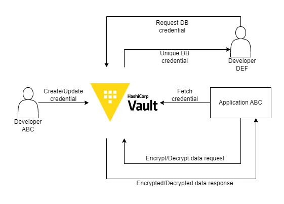

# edgesec-Vault

This project provides a HashiCorp Vault deployment for the edgesec HCI platform, serving as the central source of truth for all credentials and secrets. It is designed for multi-tenant environments and integrates with the Proxmox SDN Fabric and other edgesec platform components.

## Features
- Centralized secrets management for edgesec HCI
- Multi-tenant isolation using Vault namespaces
- Ready for integration with edgesec-RADIUS, edgesec-REST, and other platform services
- Easy deployment via Docker Compose


> **Security/Networking Best Practice:**
> For multi-tenant, multi-host Proxmox SDN environments, deploy each tenant's Vault OSS instance on the management bridge (`vmbr0`) across all their Proxmox hosts. Use nftables or similar firewall rules to allow only that tenant's authorized service overlays (on `vmbr1`) to access their Vault API, and restrict admin operations (unseal, root, policy changes) to management hosts. This ensures strong tenant isolation, secure admin access, and scalable operations as tenants add more hosts.

## Quick Start

1. **Clone the repository and navigate to the `edgesec-vault` directory.**

2. **Start Vault using Docker Compose:**
   ```bash
   docker-compose up -d
   ```

3. **Initialize and unseal Vault:**
   Follow the instructions in the Vault logs to initialize and unseal your Vault instance.

4. **Create tenant namespaces:**
   Use the Vault CLI or API to create isolated namespaces for each tenant:
   ```bash
   vault namespace create tenant1
   vault namespace create tenant2
   # ...repeat for each tenant
   ```

5. **Configure PKI engines, policies, and authentication backends as needed.**

## Example Docker Compose
See `docker-compose.yml` in this directory for a production-ready Vault deployment.

## References
- [Vault Namespaces Documentation](https://developer.hashicorp.com/vault/docs/enterprise/namespaces)
- [Vault Docker Documentation](https://hub.docker.com/_/vault)
- [edgesec Platform Overview](../README.md)
